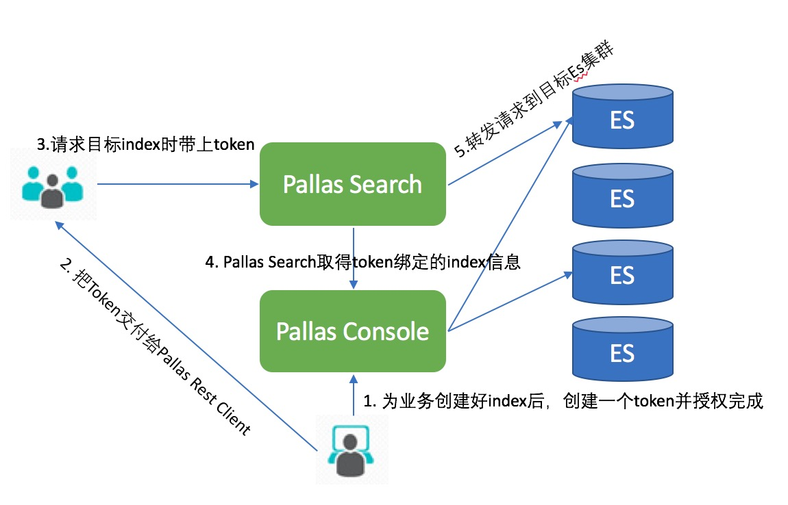
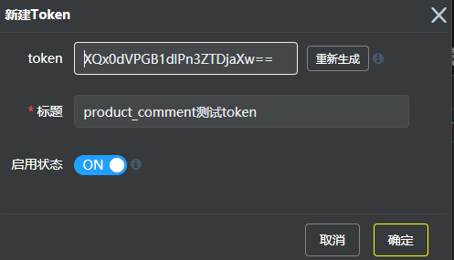
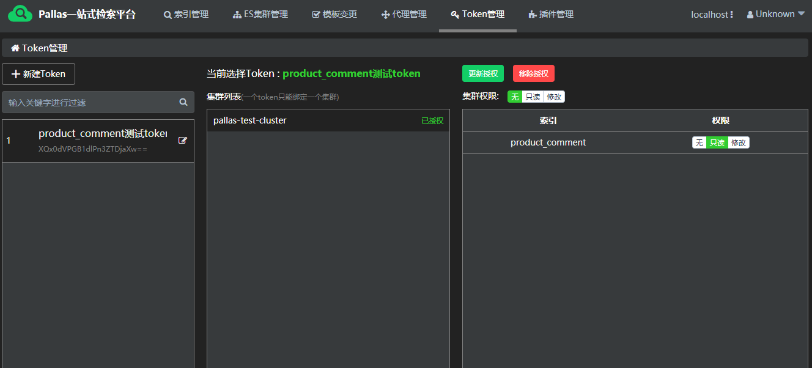

## 概述

Pallas 宗旨是为业务方建立一个统一的，快速构建的信息检索平台，其后台可能运维着几十个ES集群。开发人员如果直接和ES集群交互，存在以下痛点：

- 业务方需要了解索引所在的集群，而且有些索引为了实现高可用，存在于多个集群中，进行索引切换时又增加了开发人员的负担

- 同一索引，业务方角色不同，对索引的权限也可能不同，有些角色具有只读的权限，有些角色具有读写的权限


因此，为了使得业务方可以更多关注自身业务，而不需要关注其Index具体是在后台的哪个ES集群；同时区分不同角色对同一索引具有的不同权限，Pallas 采用Token机制，Pallas Rest Client， Pallas Console， Pallas Search共同实现这一功能。

Token的调用示意图如下：

如上图所示，当业务方的index发生了迁移ES集群时，只需要在Console上改变Token对ES集群的授权即可，整个过程对于业务方是透明的。

## 1 使用Token

### 1.1 创建

点击 Token管理栏下的“新建Token” 按钮打开Token面板，Token由一串自动生成的MD5经过Base64编码后的字符串组成（可以用任意自定义字符串），标题用于区分不同的Token（建议以业务+开发负责人命名），默认是启用状态。



### 1.2 授权
创建完token后需要对这个token进行授权如下图所示：



由于Pallas Search 需要找到一个相对应的集群进行检测路由，因此一个Token只能绑定一个Pallas ES 集群（注意，这个Pallas ES 集群可以是个逻辑集群，背后可以绑定多个ES物理集群），选好了集群之后可以对这个集群单独授权，或者只对里面的索引进行授权。

### 1.3 使用

当业务方拿到了Token，则可以使用PallasRestClientBuilder的build()工厂方法生成RestClient并正常使用。

```java
// 方式一：自定义httpClient
RequestConfig.Builder requestConfigBuilder = RequestConfig.custom()
        .setConnectTimeout(5000).setSocketTimeout(60000)
        .setConnectionRequestTimeout(3000);
CloseableHttpAsyncClient httpClientBuilder = HttpAsyncClientBuilder
        .create().setDefaultRequestConfig(requestConfigBuilder.build())
        .setMaxConnPerRoute(300).setMaxConnTotal(300).build();
PallasRestClient customConfigRestClient = PallasRestClientBuilder.buildClient(token, httpClientBuilder, maxTimeoutMils);
 
// 方式二：使用默认httpClient, 参数如上；放在应用初始化的地方执行并缓存起来
PallasRestClient restClient = PallasRestClientBuilder.buildClient(token, maxTimeoutMils);
```
 更详细的Pallas Rest Client 请参考相应的Client使用章节。

## 2 授权逻辑

当业务方Client发送请求到Pallas Search时，Search会把Client的请求类型和这个Token的权限进行匹配，判断顺序如下：
*   目标集群的修改权限
*   目标集群的读权限
*   目标集群下目标索引的修改权限
*   目标集群下目标索引的读权限
*   返回403 Forbidden

如果业务方Client希望执行相应的操作，则必须具备有相应的权限。Pallas Search对Client端的操作类型判断规则如下:
*   URL包含 "/_search/template"、"/_search"、"/_render"、以/{id}结尾、"/_settings"和"/_mapping"结尾和直接"/{indexName}/"结尾的GET请求，认为是索引读操作
*   上面请求，以及“/_bulk”、“/_update”、“/_update_by_query”、“/_delete_by_query”的“POST”操作、以及“PUT”和“DELETE” 请求，认为是索引的修改操作
*   URL中识别不出有 index pattern的的“GET”请求，认为是集群的读操作
*   URL中识别不出有 index pattern的的“POST”请求，认为是集群的修改操作

想了解更多关于授权检测逻辑可以参考Pallas Search 部分章节。

## 3 启停Token

当需要对Pallas Search进行升级维护，或者不想部署Pallas Search的时候，可以通过禁用Token 功能来是的Pallas Rest Client 进行直连ES 集群。


停用或者启用一个Token需要注意，Pallas Rest Client 采用的调度是每10s 访问Console 域名获取Token绑定的ES域名，当禁用Token后，在下一次的轮询时Console将会直接把绑定的ES集群域名返回给Pallas Rest Client，而不再是Pallas Search 的域名，因此必须保证这个ES域名是可访问的。

