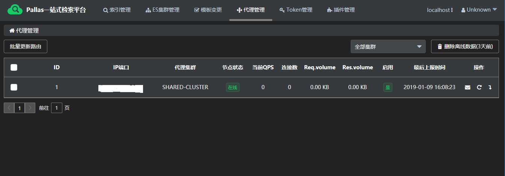
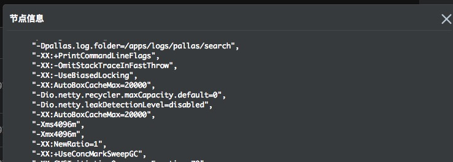

概述
---

Pallas Search承接所有调用域到ES集群的请求，记录和监控其本身的Gauge如 QPS，Conns，和 Latency等信息。为了开发和运维等相关人员能够更好的监控Pallas Search，Pallas Console提供其监控信息的可视化显示，并提供一系列快捷操作。

## 1 状态信息总览 

`Pallas Search` 会定时（默认10s）将自己的状态上报到 `Pallas Console`，在`代理管理`面板中可以观察到当前所有`Pallas Search`节点的状态信息。


如图所示，从`代理管理`面板中可以查看的信息有：IP、端口、`Pallas Search`所属域、状态，当前吞吐量、上报时间和启动环境变量等信息。

## 2 更新路由

> 提供`单独`，`批量`两种方式更新路由信息

`Pallas Search` 通过定期查询`Pallas Console` 接口来获取最新的索引路由表配置信息，默认这个配置间隔是`30s`，也就是说，从`Pallas Console`配置某索引的路由信息开始，到其在`Pallas Search`生效时，间隔最长是`30s`。通过更新路由按钮直接触发更新操作，`Pallas Search`会立即更新索引的路由信息。

> 路由设计详见索引路由和Pallas Search设计

## 3 节点状态

- `Pallas Search` 每`10s` 会上报自己的状态到`Pallas Console`，其中包括有一些统计数据还有启动环境变量等数据；
- 当超过2次心跳丢失时（20s），`Pallas Console`则会认为这个`Pallas Search`节点已经下线，那么将不会把这个节点下发到`Pallas Rest Client`的服务发现请求，只有在下一次的心跳成功上报到`Pallas Console`后，后者才再次把这个节点标记为`在线`，进而再重新下发给`Pallas Rest Client`。

## 4 启动环境变量查看

通过点解面板右边`信封` icon ，即可查看该节点的启动变量参数。

## 5 启用和停用

当需要对`Pallas Search`进行Rolling Upgrade时候，需要对节点依次进行下线操作。点击`下线` icon  时，即可对该节点进行下线操作，所有的`Pallas Rest Client`在下一个10s向`Pallas Console` 查询`Pallas Search`服务列表的时候，将不会再拿到这个节点。

确定该节点的所有连接数、QPS、吞吐量都归零之后，即可把这个节点下线和进行升级操。操作完成后点击`上线` icon  按钮进行上线，该节点的流量将会在10s后恢复。

## 6 删除离线节点数据

删除`3`天前的无效代理节点数据。