## 概述

业务背景：

- 不同的域集群、不同的业务数据团队，都会有各自的分词、查询Script逻辑，封装成Pallas插件后，各团队维护着各自的插件代码 
- 当插件代码需要更新时，就涉及上线流程，如果走常规代码版本上线流程，对于插件来说，略显繁琐，还有ES集群节点机器的域归属等问题

目标：插件自管理驱动及简化上线流程

  - 所有业务插件由pallas-console集中化，按域管理
  - 在线上传插件代码，存储到对象存储系统，安全可靠高效
  - 插件发布在线审批、指定节点、版本、时间推送
  - 插件灰度，自动免重启reload
  - 插件启用、禁用、降级、回滚
  - 插件运行状态上报、异常告警

## 1 ES原生插件

### 1.1 部署

ES原生插件部署起来不算复杂，把插件解压到$ES_HOME/plugin，然后重启es，加载成功的话就可以正常使用了。


### 1.2 重启

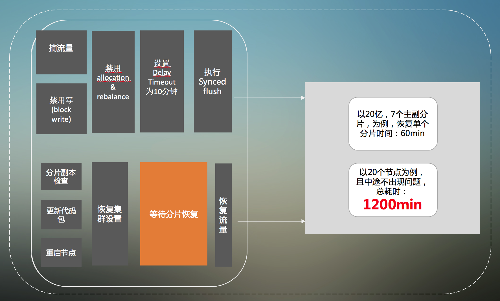

逐台升级（没有智能计算分批处理的话），当集群节点数比较多时，整个重启过程，就会变得非常漫长，增加了线上故障的风险。


## 2 Pallas-plugin


### 2.1 设计

#### 2.1.1 系统架构

通过准实时监听，动态加载，达到插件在线管理、动态部署、es免重启等能力，插件升降级，对搜索调用不会造成任何影响。

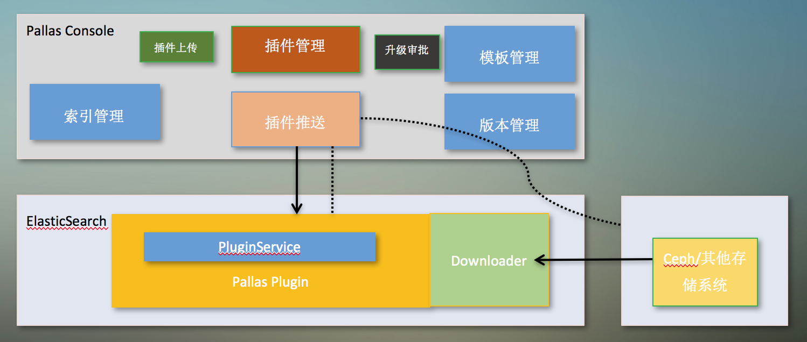

- 插件管理包括当前各集群各节点的全部插件查看、下线（删除）等功能

- 插件推送，是指新建一个推送事件，包括upload插件、设定更新时间、提交审批等

- 用户通过console上传插件代码，上传成功后，pallas把代码会同步到对象存储系统

- 只有当管理员审批推送请求通过后，系统会把升级信息推送Plugin Agent

- Plugin Agent fetch到升级事件后，从对象存储系统获取要升级的包，到达预设时间点，则替换运行时的插件包，完成升级

- 插件管理中执行插件下线功能，Agent会把相关的插件子目录移除，完成插件卸载

#### 2.1.2 交互流程

Pallas-plugin中，console与es的交互如下图所示：

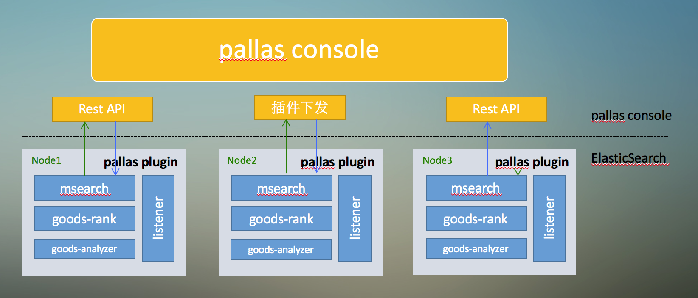

Pallas-plugin作为原生插件，部署在es当中。通过一直保持/keepalive endpoint监控调用，接收console关于插件管理的指令(包括插件下载、启用、卸载等指令)。


#### 2.1.3 实时动态加载

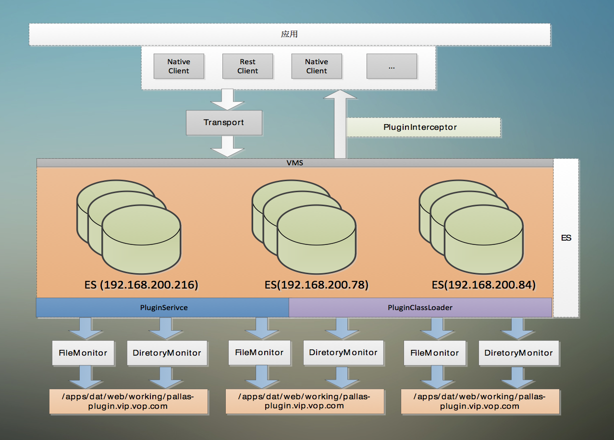

2.1.2节中提到Pallas-plugin通过/keepalive获取插件下载指令后，会把插件下载到指定目录，并解压好，FileMonitor监控到文件变化后，调用插件初始化程序。

通过classloader的切换，间接达到了插件运行时的切换，对象没有引用后，旧的插件及classloader都会被回收，达到classloader级别的热部署。

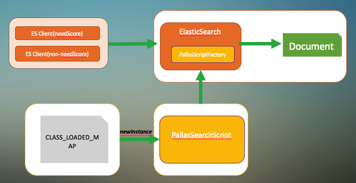


#### 2.1.4 升级流程

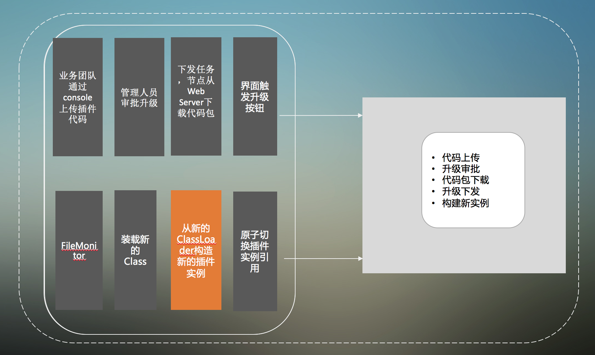
 
#### 2.1.5 优势

* 可插拔式的动态组件，适用于任意Java场景；
* 非字节码修改，JIT有效；
* 在线升级，无缝变更，实时生效；
* 干净卸载无残留；
* 钩子回调，秒杀业界任意竞品；


#### 2.1.6 部署

Pallas-plugin是一个es原生插件，目前支持java 1.8, es 5.x版本，release默认适配5.5.2版本。如果使用的es不是此版本，需要修改plugin-descriptor.properties的es版本号，部署及生效与普通es原生插件一致。

### 2.2 Pallas-plugin开发

#### 2.2.1 增加maven archetype

在Idea（Eclipse类似）中通过new -> Project... -> Maven操作路径，勾选Create from archetype，点击Add Archetype，在弹出的输入框中，输入：

GroupId|ArtifactId|Version
-|-|-
com.vip.pallas|pallas-plugin-archetype|1.0.0（视迭代版本而定）

如下图所示：

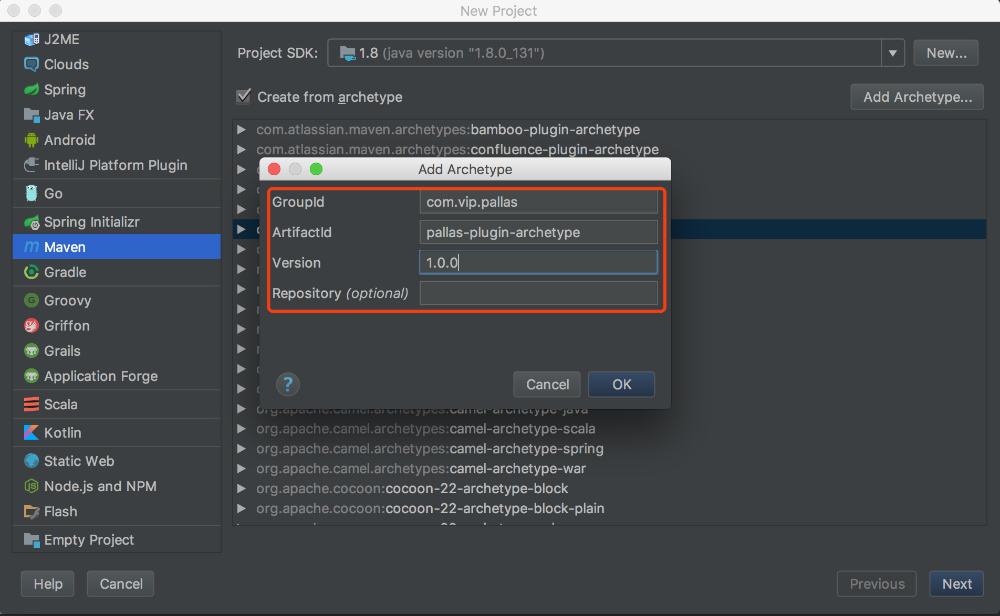

#### 2.2.2 生成maven project
根据archetype生成出来的project，会包含如下内容，已经自动生成好业务插件的开发配置，可以参考示例的插件代码进行插件开发:

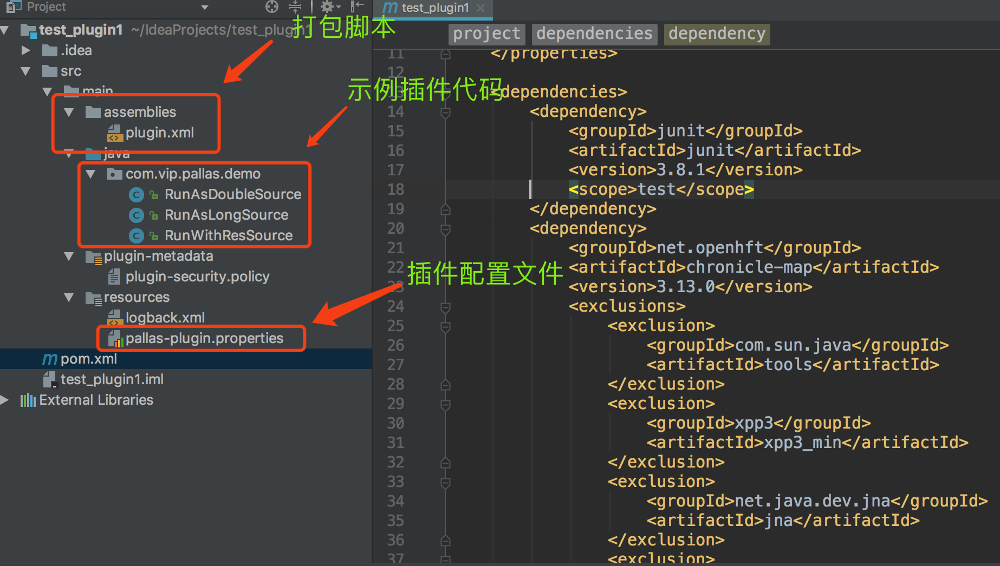

> 注意:

  * 修改plugin.xml里面的baseDirectory

    <baseDirectory\>modified-when-necessarily</baseDirectory\>
  
    要把modified-when-necessarily修改成业务插件名字，一般带业务团队名字标识，如msearch-plugin，这个名字会作为zip的base directory，也就是部署时的子目录
  
  * 静态资源初始化
    可以直接使用Java Class的static变量，或者static块直接初始化资源，如db resource，nosql resource
  
    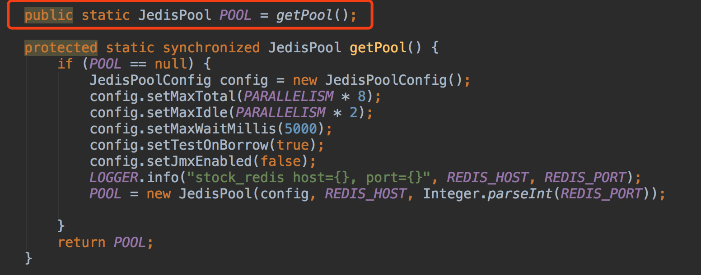  

  * 静态资源销毁
  
    在实现的destory里面，直接操作静态销毁方法实现销毁

    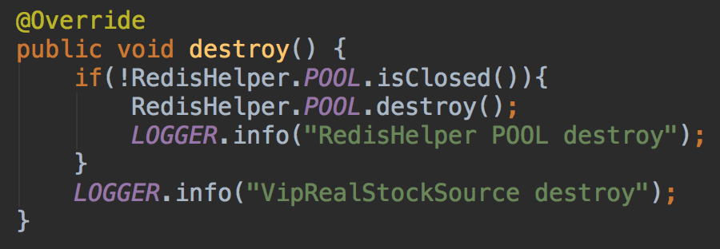 
    
#### 2.2.3 插件开发

SourceClass必须extends AbstractPallasXXXXSearchScript，覆盖有参构造函数。

从传入的Map<String, Object> params参数中提取要获取的字段值，保存下来，供run()方法调用。
需要注意的是，对params.get(key)获取出来的是Object，需要转型，在这之前，需要判断key是否为空或者获取的value是否为null，再进行转换类型，如:

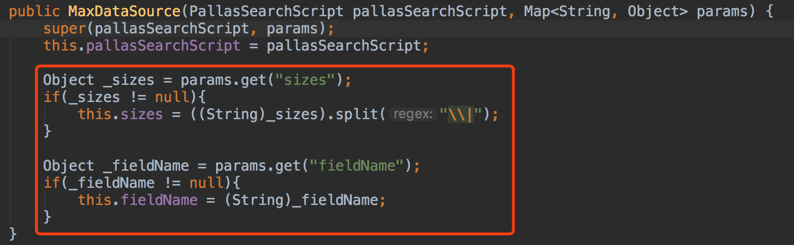 

#### 2.2.4 插件配置

SourceClass开发完之后，需要进行配置，才会加载相应class，配置示例如下：

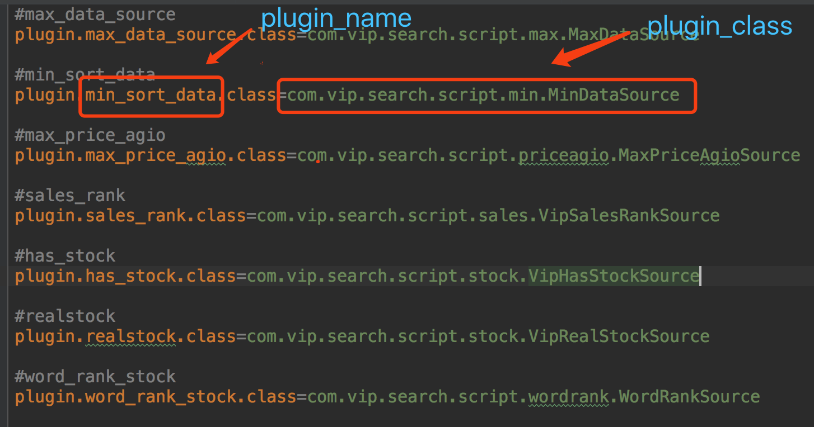 

#### 2.2.5 模板调整

把script中的inline（ES 5.6后为source）固定修改成"pallas"（其实是原生插件的名字），然后在"params"增加子元素"_plugin"，填写pallas插件的名字：

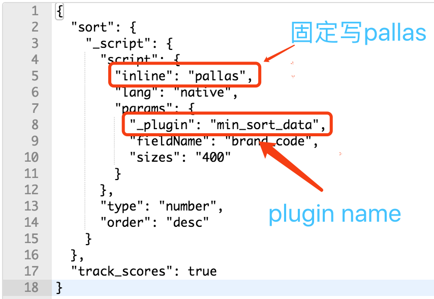 

#### 2.2.6 logback.xml修改

把business-plugin修改成具体业务插件名字，如msearch-plugin：

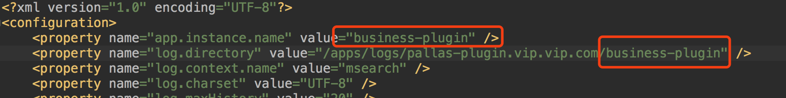 

#### 2.2.7 自定义插件存储

默认情况下，默认插件文件处理类为PluginDefaultFileProcessor，插件上传后，会存储在web server的System.getProperty("java.io.tmpdir") + "/pallas/plugin/"目录，该Processor同时提供上传下载等行为。

```java
public class PluginDefaultFileProcessor extends AbstractPluginFileProcessor {

    private static final File PLUGIN_DIR = new File(System.getProperty("java.io.tmpdir") + "/pallas/plugin/");

    static {
        if(!PLUGIN_DIR.exists()){
            PLUGIN_DIR.mkdirs();
        }
    }

    @Override
    public String upload(String clusterId, String pluginName, String version, File file) throws Exception {
        FileUtils.copyFile(file, new File(PLUGIN_DIR.getPath() + "/" + clusterId + "/" + pluginName + "/" + version + "/" + pluginName + "-" + version + ".zip"));
        return "http://xxx/pallas/plugin/upgrade/fileDownload.json?clusterId=" + clusterId + "&pluginName=" + pluginName + "&pluginVersion=" + version;
    }

    @Override
    public File download(String clusterId, String pluginName, String version) throws Exception {
        File tempFile = new File(PLUGIN_DIR.getPath() + "/" + pluginName + "-" + version + ".zip");
        
        if(tempFile.exists()){
            FileUtils.deleteQuietly(tempFile);
        }

        FileUtils.copyFile(new File(PLUGIN_DIR.getPath() + "/" + clusterId + "/" + pluginName + "/" + version + "/" + pluginName + "-" + version + ".zip"), tempFile);
        return tempFile;
    }
}
```

由于是单机存储，存在单点风险，同时，文件无法共享。可引入分布式存储，统一管理，直接新实现一个Processor（参考PluginDefaultFileProcessor，扩展AbstractPluginFileProcessor，重写相关方法），然后在console配置加载即可。
 
### 2.3 Pallas插件使用

#### 2.3.1 升级

主菜单`插件管理`进入页面，点击`新增插件`按钮，填写信息并上传插件，如下图所示：

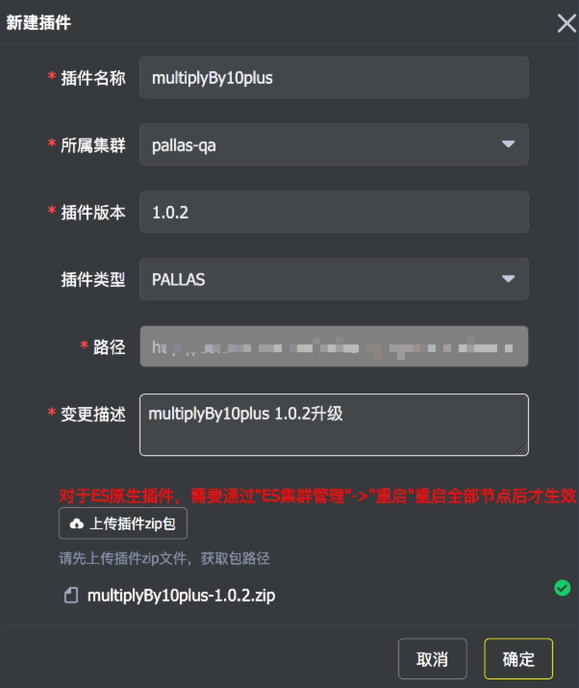 

**注意：插件release包为zip格式，解压出来的为插件名字+插件版本号的目录，目录里面是运行的jar，需要符合目录规范才能被接受（通过archetype生成的代码工程已经规范好打包脚本）**


#### 2.3.2 插件审核

新增插件成功后，流程自动进入待审核状态，等待具有管理员权限的用户审批。

 

点击`multiplyBy10plus`（插件名字），进入具体插件管理界面。

 

在插件具体详情页面，可以看到刚刚提交的新增升级，管理员可以操作点击`开始下载`、`审核不通过`，申请人可以操作点击`取消`

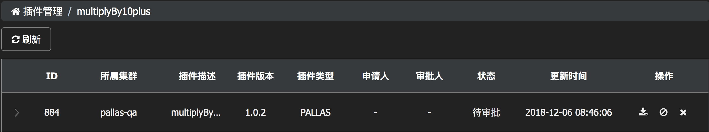 

#### 2.3.3 插件下发

点击`开始下载`按钮，console会为每个节点生成下载指令，节点的最近下次请求/keepalive的时候，会把指令取走，并触发pallas-plugin发起url进行插件包下载，下载地址为：`http://xxx/pallas/plugin/upgrade/fileDownload.json?clusterId=" + clusterId + "&pluginName=" + pluginName + "&pluginVersion=" + pluginVersion`

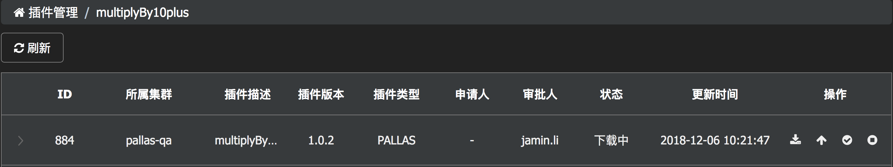 

如果因网络故障，系统响应等因素，可以重复点击`开始下载`按钮，再次下发。

按`F5`刷新页面，也可以点击列表左侧的展开箭头，查看每台节点的下载情况：

 

#### 2.3.4 插件启用

下载完成后，页面会出现`开始升级`按钮，当然，你也可以选择终止，假如升级终止的话。

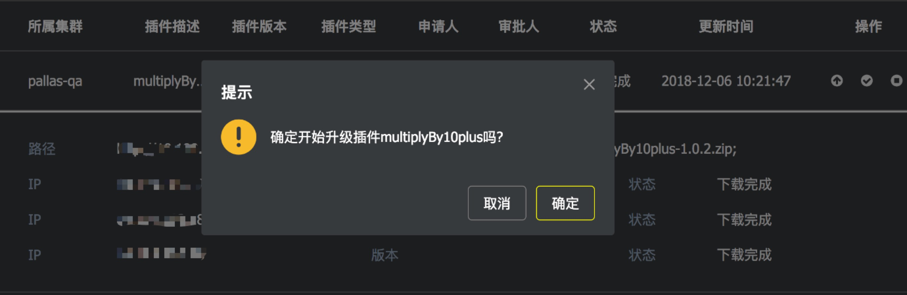 

升级提交后，就等待pallas-plugin处理就好，当然，你也可以第一时间撸一撸各节点的日志，早看早心安。。。

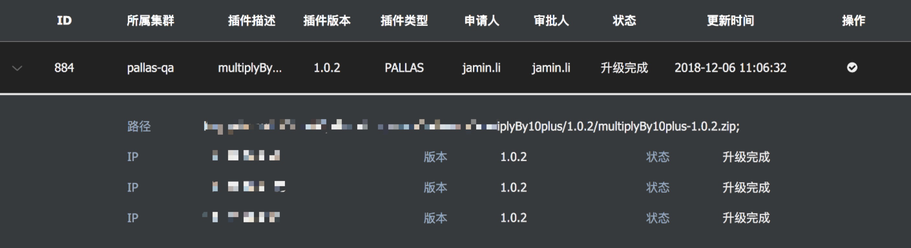 

最后，可以点击`标记完成`，标识流程结束。

#### 2.3.5 插件回滚

流程结束后，会出现`回滚按钮`，点击该按钮，即会发起回滚到该版本的流程。

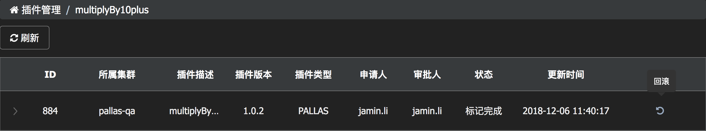

点击`回滚按钮`，即会发起新的工单。


这个跟最初的升级流程是一样的。

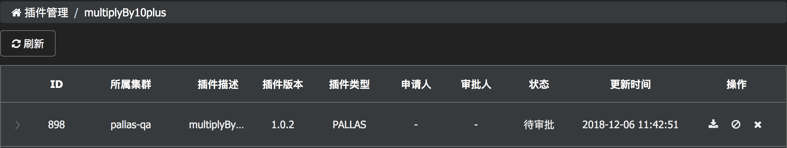  

