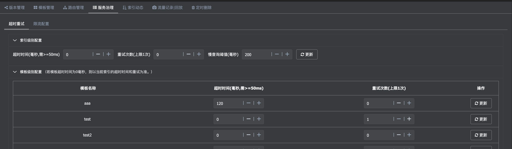
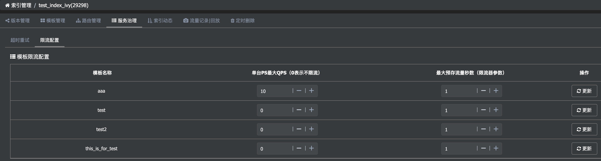

概述
---  
服务治理主要包含超时重试和服务限流两部分。配置又分为索引级别和模板级别。

## 超时重试

  针对不同索引，可以配置不同的超时时长；也可以针对各模板配置，如下图所示。
  
  更详细的见`模板管理`相关章节。

  

## 限流配置

   目前Pallas-Search实现了按部署池隔离不同的业务请求。
   
   按这种模式部署，一个业务出现问题也不会影响到其它业务。
   
   但是如果某个模板查询很耗资源，又出现故障的话会导致整个ES集群不可用，影响到其它模板调用。
   
   为了更好地提供服务，部分可用好过全部不可用，引入限流机制，根据模板配置限流策略，以防极端情况下单个模板影响到全局应用。
   
   
   
