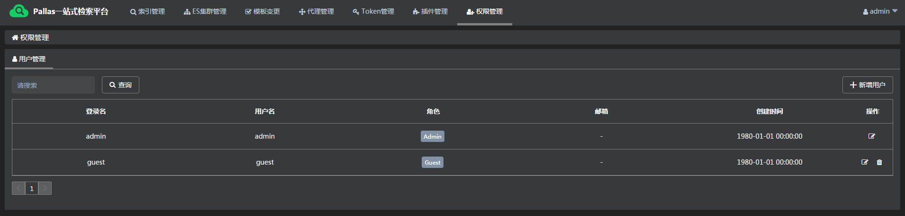
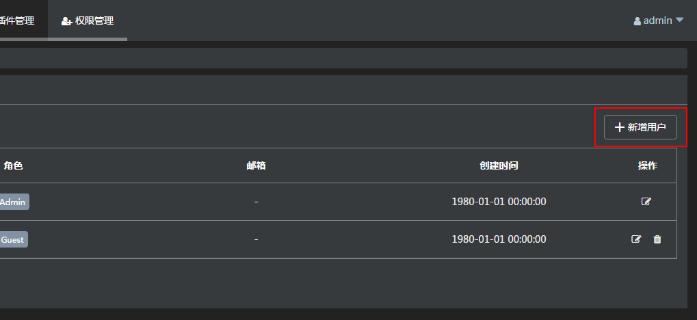
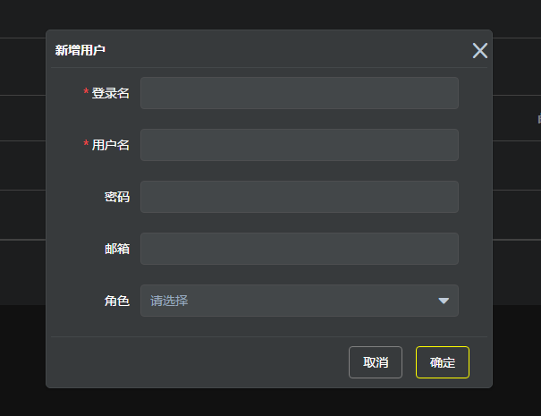
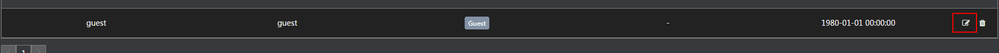
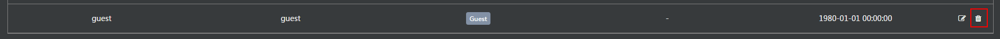

## 概述
Pallas Console 默认支持简单的用户密码登录认证以及操作授权验证。

## 1 认证

### 1.1 关闭认证功能
Console默认启用认证功能，可以通过启动参数`-Dpallas.security.enable=false`关闭。也可通过修改配置文件`classpath:/properties/${spring.profiles.active}/application-${spring.profiles.active}.properties`来进行配置。

系统默认添加了两个用户以作为Demo使用

| 用户名 | 密码 | 
| ------ | ------ |
| admin | admin | 
| guest | guest | 

### 1.2 用户密码与格式
Pallas 提供的用户认证功能，默认使用`明文`保存用户密码，**正式的生产使用，请务必替换**。

用户信息保存在`user`表中，密码存储格式需要结合认证的方式。默认情况下，password存放的是明文。

### 1.3 认证跳转配置

Pallas 当前只支持简单的用户密码登录，可以通过启动参数`-Dpallas.login.url=${DOMAIN_NAME}/#/login -Dpallas.success.url=${DOMAIN_NAME}` 配置登录url以及登录成功后的跳转链接.

## 2 授权

### 2.1 关闭授权功能
Console默认启用授权功能。如果想要单独关闭授权功能，可以通过添加启动参数`-Dpallas.authorization.enable=false`关闭。

系统为默认的两个用户分别指定了对应的角色

| 用户名 | 角色 |
| ------ | ------ |
| admin |  Admin |
| guest |  Guest |

### 2.2 角色与权限
Pallas Console为不同的系统模块设置了不同的权限，同时设定了两个不同的角色，如下表所示。Pallas 目前不提供页面用以直接 添加/修改/删除权限和角色的功能。

| 模块 | 权限 | 角色 |
| ------ | ------ | ------ |
| 集群管理 |  cluster.all.write | Admin |
| 索引管理 |  index.all.write | Admin |
| 版本管理 |  version.all.write | Admin |
| 模板管理 |  template.all.write | Admin |
| 插件管理 |  plugin.all.write | Admin |
| 代理管理 |  pallas-search.all.write | Admin |
| Token管理 |  authorization.all.write | Admin |
| 用户管理 |  user.all.write | Admin |

**当前Guest角色未关联任何的权限值**。

系统中还存在一些特定的权限操作只能用户本人操作，如：模板变更审批取消

>当前Pallas Console权限只实现了到了模块级别，如果需要更细力度的权限控制，比如：某一个具体的集群，索引等，请自行实现`com.vip.pallas.service.impl.PrivilegeServiceImpl` 的方法

## 3 用户的管理

Console提供了基础的用户管理功能。可以添加新用户，以及对已录入用户进行编辑和删除操作

### 3.1 添加用户
权限管理页面，点击“新增用户”按钮

为用户添加权限，进入“权限管理”页面，点击“添加权限集”按钮。

录入登录名、用户名，角色等基础信息之后就可以创建新用户。

密码可为空，密码为空的用户账号可以只通过用户名登录系统。

### 3.2 编辑用户

通过数据行的编辑按钮，可以对当前用户的密码、邮箱、角色等信息进行修改。

### 3.3 删除

点击删除按钮，可以对某一非当前登录用户的进行删除操作。

