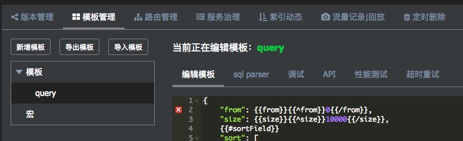
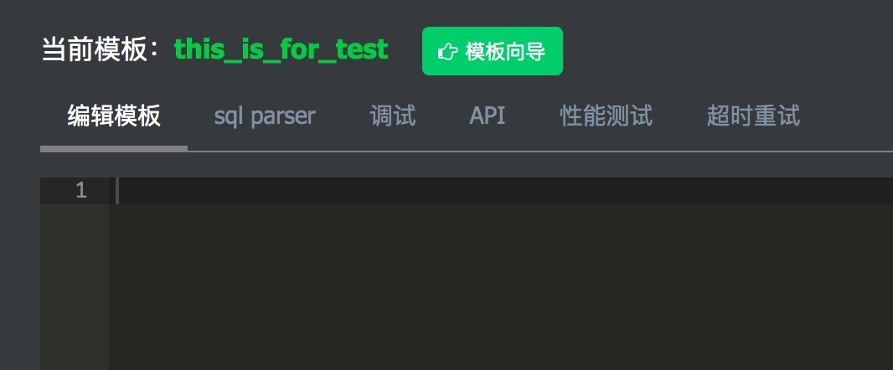
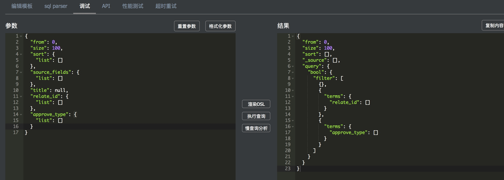
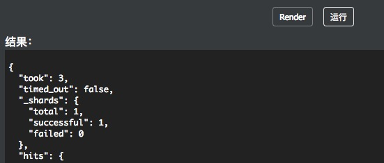
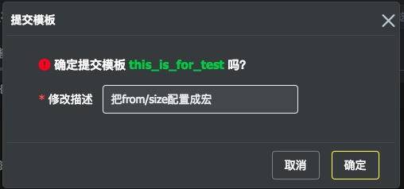
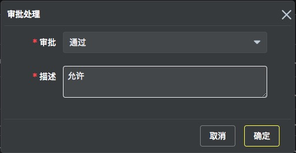
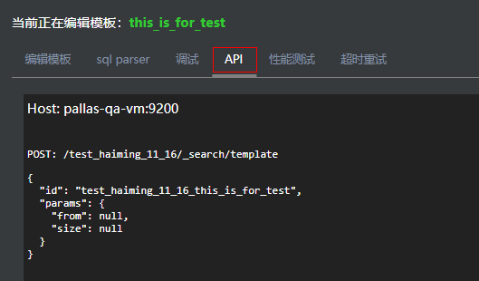
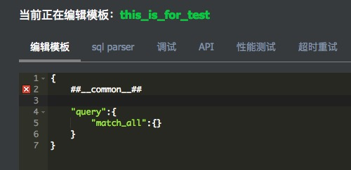
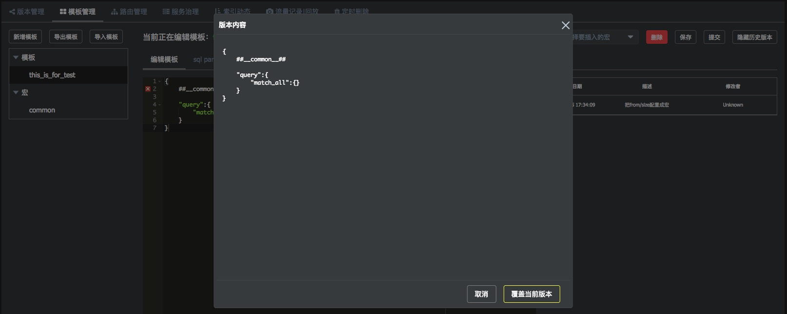
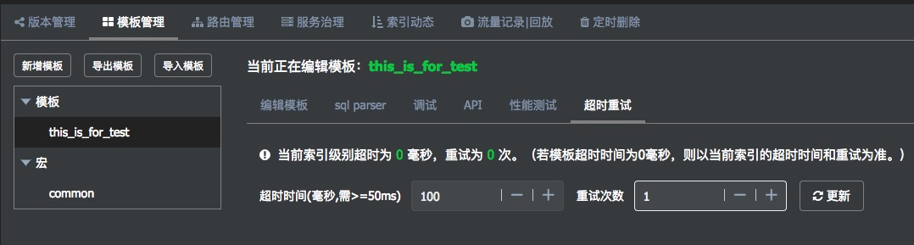

## 概述

- 为统一各业务方的请求格式，同时为了便于管理和维护，Pallas 建议Pallas Rest Client采用Search Template的请求方式向Pallas Search发送请求

- Pallas Console推荐同一类性质的查询使用一个模板

- Pallas Console中的“模板管理”模块,维护`索引`级别的模板，同一个索引下的不同版本共享此索引下的所有查询模板，切换索引版本并不需要切换模板

> 注意：同一个Pallas 索引下，模板名称有唯一性要求。但是为了隔离同一个ES集群下不同索引的模板，Pallas Console在推送模板到ES的时候，会自动添加 `${index}_` 前缀，例如，一个 `test` 索引下创建一个`query` 模板，最终推送到ES 的模板id 是： `test_query`。 

## 1 新增模板

点击`新增模板`按钮新增一个查询模板，在编辑区域可以填写模板内容，模板书写以及`Mustache`的语法请参考Elasticsearch 相应章节。

>[Elasticsearch Reference [5.5] » Search APIs » Search Template](https://www.elastic.co/guide/en/elasticsearch/reference/5.5/search-template.html)

>[Elasticsearch Reference [5.5] » Deleted pages » Painless Syntax](https://www.elastic.co/guide/en/elasticsearch/reference/5.5/modules-scripting-painless-syntax.html)

## 2 调试

当编辑完成后，点击右上角`保存`按钮进行暂时保存。注意，此时只是将模板保存在Pallas Console数据库中，并没有推送到ES，可以重复编辑模板，或者去调试面板对模板进行调试，如下图所示:


在参数区域填写模板里面需要传参的所有参数（Json格式），参数区域最终会被构造成ES模板查询请求中的`params`的值。

当填写好参数后，可以选择点击`Render`按钮进行渲染ES request来查看，或者是点击`运行`按钮把请求发送到ES进行debug。

Render:

运行：

## 3 提交审批

当一个模板完成了编辑和本地调试之后，即可进行提交审批，并把模板推送到ES去。在未推送之前，所有的本地调试都是通过`_search/template`的`inline`机制来进行调试，只有推送到ES之后，Pallas Rest Client才可以发起请求访问。
点击`提交` 按钮可以发起提交一个模板审批：

模板的审批需要`系统管理员` 在`模板变更`栏操作。管理员可逐条变更审批，或者批量审批模板。当点击通过时，模板会被推送到ES去覆盖旧的同名模板，如果选择审批不通过，则模板会回退到编辑状态，已上线运行的版本不受影响。

## 4 接口信息

点击`API`tag，查询API调用接口。详情见Pallas Rest Client。

## 5 其他功能

### 5.1 模板与宏

  对索引进行查询时，不同的模板往往会有部分条件是相同的或者common的（比如基础条件过滤，相同的filter，相同的from size 条件等）。当需要对这部分common的内容变动时，就会修改全部的模板。Pallas Console把这部分公共的条件抽取出来放到一个`宏`里面，如图所示：
    


  开头的例子中，from、size 两个变量放到一个`common`的宏里面。插入宏的语法是`##__{name}__##`,如下：

  

  如果对一个宏文件进行编辑，那么使用了这个宏的所有模板都会被标记为`新`状态，表示被编辑过，需要提交审核才能把更新推送到ES。

### 5.2 版本控制

  为了保证上线的模板可追溯，Pallas Console的模板加入了版本控制的功能。每次模板审批上线后，都会留存一份历史版本在Pallas Console的数据库，在`模板管理`页面通过点击右边的`历史版本`来查看历史，或者把历史版本拷贝进编辑区。

  

  > 注意，用历史版本覆盖当前版本时，仅仅只是把内容覆盖到编辑区，你仍然需要点击保存，或者提交审批来是用新的修改。

### 5.3 超时重试

  对于不同的查询模板，可能请求的时延会有差别，例如一些简单的查询模板调用是毫秒级，而一些重查询模板调用可能是秒级。Pallas Search 可以提供一个`模板`级别的超时重试的机制，如对于上面的测试模板，希望超过100ms的时候由Pallas Search 发起一次重试（其目的是ES当前某个分片可能刚好做merge或者在IO，希望Pallas Search发到其他replica再次查询以减少超时的概率）,如以下例子配置：

  

  注意：点击更新之后 Pallas Search 需要每30s 访问Pallas Console得到最新的配置并刷新本地缓存，因此配置最晚的生效时间是30s左右。关于Pallas Search 更详细的逻辑请参考Pallas Search相关章节。

### 5.4 sql parser

  提供sql转DSL的功能，为业务人员将sql转为查询查询模板提供帮助。
