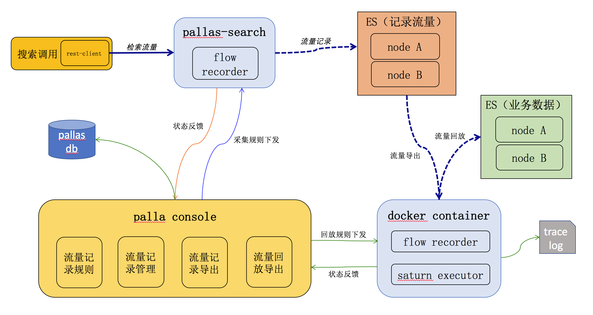
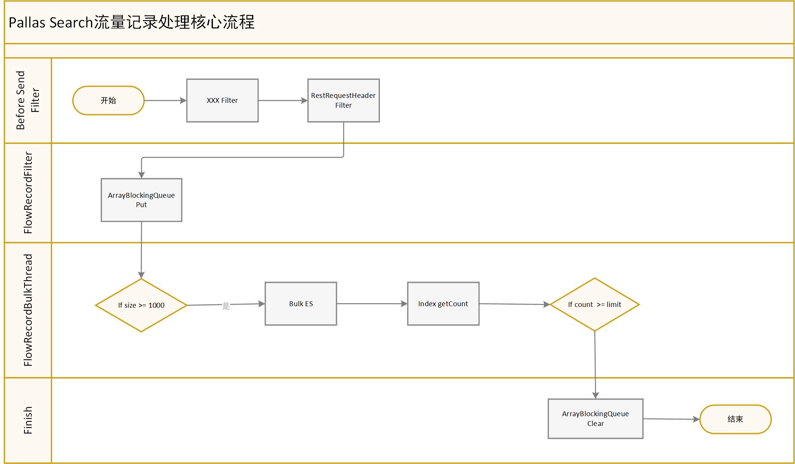
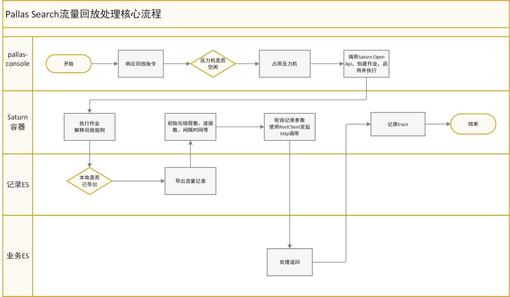
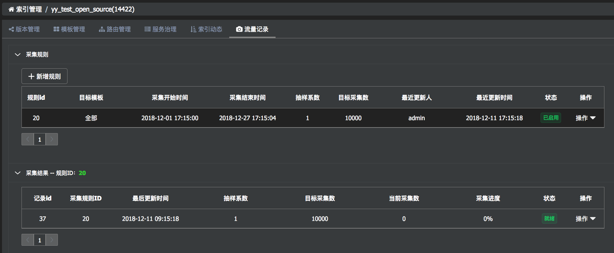
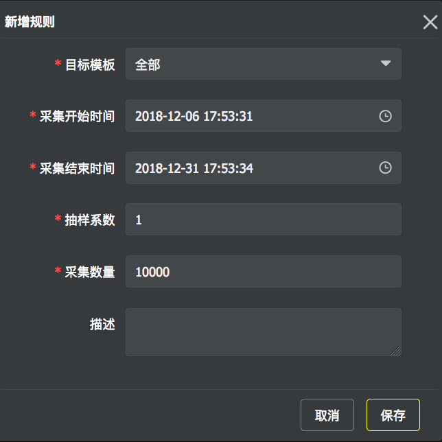
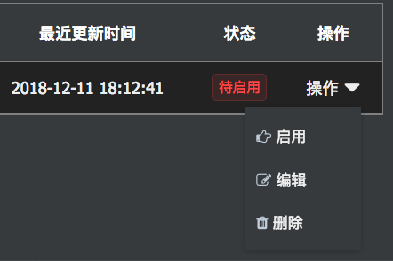
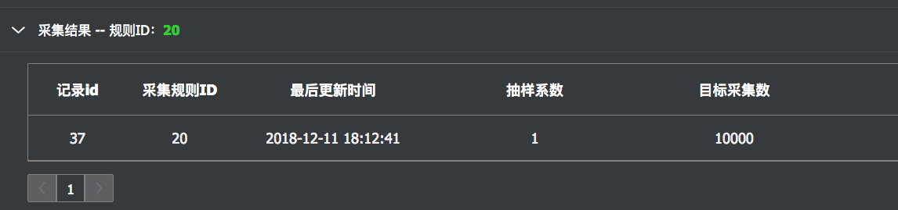
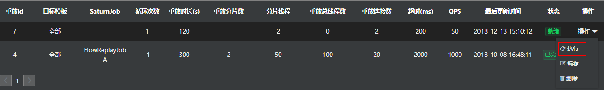

## 概述

Pallas支持对经过Pallas-search组件的流量进行采集、保存、离线导出等操作，并且支持对导出的流量进行二次回放、甚至压测等操作。

## 1 业务背景

  - 索引出现访问延时毛刺，如何在促销放量前快速预热，喝着咖啡妥妥地过大促？
  
  - 修改了查询模板，怎么做到信心满满地切换，保证正式启用后没有问题，能不能先灰度一下观察效果？
  
  - 索引出现性能问题，到大促前要做好容量评估，想借用最近生产历史流量压测一把，尽可能的模拟实际生产场景？

  > Pallas-search流量记录与回放可以解决上面各种痛点！

## 2 概念

  - 流量采集：主要指对经过Pallas-search端的调用方的访问地址、请求参数、访问的索引/集群等信息进行记录。
  
    - 可以指定索引、模板（可选），按照设定要记录的条数、起止时间进行记录，过期的数据可以手动进行清理
  
  - 流量回放：对流量记录进行场景重现，可以在原集群或者新集群进行回放。
  
    - 支持线上线下压测， 对下载下来的离线流量数据回放到各环境进行场景重现

## 3 设计

### 3.1 架构设计：

  - 流量回放可以配置为其他集群，不一定是原来采集集群
  - noah container长驻两个回放压测容器，同时最多支持两个回放作业执行，超出请求需要排队

### 3.2 采集设计

  

  - 采集结束条件：采集结束时间、采集量（limit），两者互斥
  
  - 在pallas-search分布式部署的架构下，裸数据的存储总体数据量会达到或稍超出limit的上限，为limit近似值
  
  - 通过ES进行裸数据存储
  
  - 索引名带有目标索引和模板标识（可选），存储在与目标索引所在的集群里面
  
  - 考虑到查询压力与负载情况，初步考虑两个主分片，不设复制分片
  
  - 索引分布，可以限定机器，或者与目标索引跟随
  
### 3.3 回放设计（暂未开源）

  
  
  - 压力机占用： 同时可支持最多两个模板灰度作业运行，占用成功则获得当次压力机的使用权
  
  - 流量导出：通过访问pallas-console的export url直接从es导出，形如：http://localhost:8080/pallas/record/flow_record/export.json?recordId=8，支持流式导出
  
  - 流量回放：加载回放规则，设定请求的线程数、连接数等，通过apache httpclient回放记录的请求，规则包括：
  
    - 请求线程数
    - 连接数
    - 请求间隔时长
    - 容忍超时时间
    - 样本是否互斥
    
  - 性能监控：使用Mercury aop进行http拦截，数据统计归入专门域及服务当中，方便对比及分析

  - 异常处理：
    - Pallas-console增加定时器，定时扫描flow_replay表，当发现update_time远小于正常期望值时，需要程序把记录数据、回放数据、已提交的es测试模板清理

## 4 使用指南

### 4.1 流量采集

选择将要进行流量采集的索引，进入索引管理页，点击`流量记录\回放`菜单tag，点击流量采集tag，即可看到当前索引关联的采集规则，如下图：



点击规则，即可展示此规则的采集结果。

#### 4.1.1 新建采集规则

点击`新增规则`按钮，弹出录入信息窗口，填下规则：

  - 目标模板：如果选择全部，则会收集此索引下所有模板的流量
  
  - 采集结束时间：不能晚于当前时间
  
  - 抽样系数：取值范围是0到1之间（包含1）的小数；
  
    - 控制采集频率，调整对Pallas-search工作线程的影响
  
  - 采集数量：取值范围为Long型

#### 4.1.2 规则启用

规则新增后，不会自动生效。如果要生效，可以点击`启动`菜单：



#### 4.1.3 规则禁用

- 禁用跟启动是反操作，禁用后，会停止该规则的采集。
- 之前已经完成采集的规则，如果想再次重用，需先将此规则禁用，修改此规则的采集时间后再次启用即可。

#### 4.1.4 查看采集结果

点击对应采集规则，即可看到采集进度及结果。

#### 4.1.5 采集结果导出



采集完成后，会出现`导出`按钮，点击后，可以下载到本地（csv格式）。同时，导出的文件支持JMeter压测重放。

### 4.2 流量回放

#### 4.2.1 新增规则

  - 模板模板：可以指定目标模板；如果不指定的话，表示该索引下的全部模板，本地模板为已经保存但未提交的模板，针对临时模板作回放
 
  - Record Id：采集结果的ID；只有当前索引采集过，并且状态已经完成的采集才作为有效选项
 
  - Token：鉴权
 
  - 循环次数：为每个分片的每个重放线程的循环次数，最终循环次数=循环次数 * 线程数 * 分片数，-1为不限，一直循环工作
 
  - 重放时长（秒）：重放作业运行的设定时长，与循环次数同时有效，其中一个条件触发后，重放即完成
 
  - 重返线程（单分片）：默认是2
 
  - 重放最大连接数： 默认是2
  
  - 超时设置：默认是200，与rest client调用超时设置同样意义 

  - 总QPS : 默认50
  
#### 4.2.2 执行重放 

  
点击执行按钮，进行重放操作。
 
#### 4.2.3 编辑与删除
 
可以编辑、删除流量重放规则。
 
### 5 其他 
#### 5.1 参数配置

采集结果会保存在es中，需要对Pallas-search配置相关参数，标识保存数据的es的地址信息等（System Property）

参数名|参数说明|示例
-|-|-
VIP_PALLAS_FLOW_RECORD_SAVE_CLUSTER_NAME|保存流量记录的ES的集群名|gd15-pes-public.api.vip.com
VIP_PALLAS_FLOW_RECORD_SAVE_CLUSTER_TRANSPORT_ADDRESS|保存流量记录的ES的transport地址|GD15-PES-PUBLIC-MASTER-API-001.idc.vip.com:9300,GD15-PES-PUBLIC-MASTER-API-002.idc.vip.com:9300,GD15-PES-PUBLIC-MASTER-API-003.idc.vip.com:9300
VIP_PALLAS_FLOW_RECORD_SAVE_CLUSTER_REST_ADDRESS|保存流量记录的ES的http地址|GD15-PES-PUBLIC-MASTER-API-001.idc.vip.com:9200,GD15-PES-PUBLIC-MASTER-API-002.idc.vip.com:9200,GD15-PES-PUBLIC-MASTER-API-003.idc.vip.com:9200

