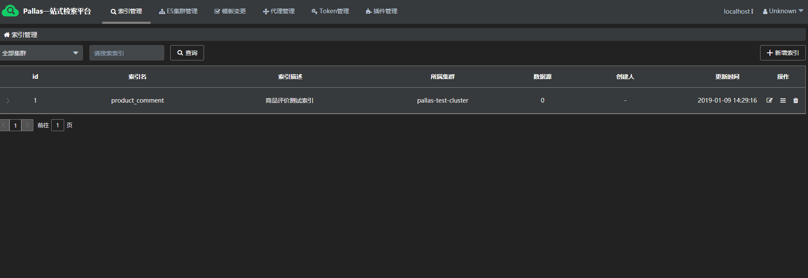
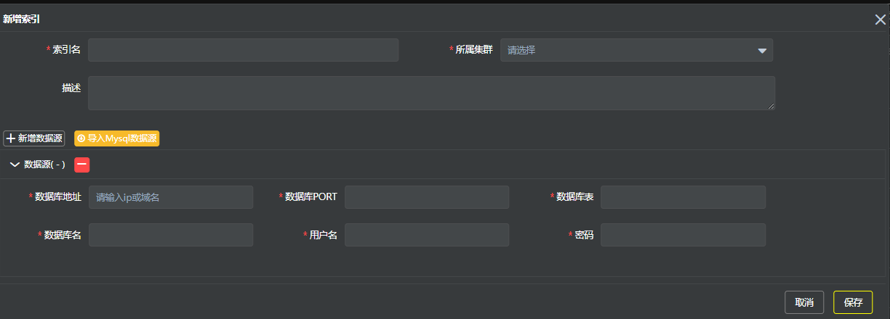

## 概述

Elasticsearch是面向文档的分布式搜索分析引擎，索引是其核心概念-存储和使文档可被搜索。为了使相关人员可以更方便的使用索引，Pallas Console索引模块提供以下功能：

- 索引的创建，查看，编辑，删除功能

- 设置索引的Mapping信息

- 同一索引，可以创建多个版本，满足业务方的不同需求

- 提供数据源的全量同步，增量同步，对账功能

## 1 索引总览

点击索引管理，可以看到索引的列表信息，并提供了操作索引的快捷入口：

## 2 添加索引

点击右上角的新增索引按钮，如图所示：

  - 索引名：同一个集群内索引名唯一，不同集群间索引名可以不唯一（见提示）

  - 所属集群：选择索引创建在哪个ES集群下
  
  - 数据源：一个索引可以对应一个mysql单表、或者mysql同构多表（多表情况需要每个表的id互相不重复）,在创建索引时请确保填写正确的数据库信息，一旦创建了索引版本，则不可更改。

## 3 编辑索引

> 注意：如果更改所属集群、数据源，需重新建立版本同步数据。

## 4 管理索引

> 详见版本管理。

## 5  删除索引
> 注意：删除索引前需确认此索引不存在关联版本。

