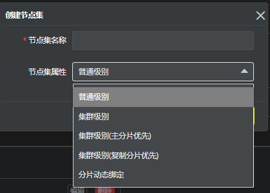
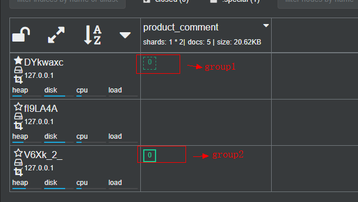

## 概述

旨在为不同的请求定制不同的路由规则，详细设计见Pallas-search

> 所有的路由规则和节点集都是索引级别的，不同索引之间互相不影响

> 当不配置任何的规则时，将没有任何的路由在这个索引下工作，最后会导致所有的发送到该索引的请求都会被拒绝

> 创建新的索引时，系统为会新建索引配置一条默认路由规则

## 1 默认路由

  默认节点集为分片动态绑定,默认路由规则不指定过滤规则
  
## 2 路由规则
  
  - 创建规则
  
     
     
      规则各个字段说明：
      
      -  规则名：在一个索引下唯一标识一条规则
      -  优先级：
      -  是否启用：设置该条规则是否启用，如果不启用，则该规则将不纳入规则运算
      -  节点集：该规则判断命中后所路由到的节点集合，支持配置一个或多个节点集，当前阶段实现只去第一个节点集来分发
      -  规则条件：用于过滤请求
      
         - 判断参数名：当前支持模板ID（X-PALLAS-SEARCH-TEMPLATE-ID），客户端IP（X-PALLAS-SEARCH-CLIENT-IP）
         - 判断运算：当前支持 = 和 ip_mask 两种运算。
         
            = ：即等值运算，包括等于某个数字，字符串，ip地址等，例如X-PALLAS-SEARCH-TEMPLATE-ID=vms2_msg_trace_query_by_msgid
            ip_mask: IP掩码运算，判断一个header的值是否属于给出的判断值所在的IP掩码段之内，例如：192.168.0.1 ip_mask 192.168.0.0/16
  
  -  规则总览
  
     
  
       > 可以配置多条规则，当前只支持规则间的AND运算
       
       > 目前多条规则按优先级从上到下排列，匹配顺序从上到下逐条进行匹配，当匹配一条规则，则直接按该条规则定义的节点组分发，不会再去判断剩下的规则
  
## 3 节点集

  节点集指一个或者几个ES集群中节点的集合，通过勾选是否集群级别，它可以代表一个集群下的所有机器，也可以代表一个集群下的仅仅包含该索引的部分节点
  
  - 新增节点集
  
    
    
    节点集属性说明：
    
      - 节点集名称：唯一标识一个索引下的节点集，该字段可更新
      - 节点集属性：
        - 普通级别：
        
          路由只会把请求分发到选中的Node节点，并且ES集群实时新增Node节点，并不会影响该节点集，如果ES集群实时减少一个选中的Node节点，路由将不会再分发请求到该节点
        
          
          
          通过勾选集群节点，设置请求可路由到哪些ES集群节点。
          
        - 集群级别:
        
          只能勾选一个或多个ES集群，路由会把请求发送到选中ES集群下的任意机器。

        - 集群级别(主分片优先)
          
          优先路由到主分片所在的集群节点
        
        - 集群级别(复制分片优先)
        
          优先路由到复制分片所在的集群节点
          
        - 分片动态绑定
        
        - 动态分组
        
          - es内部会round-robin转发请求去不同分片，所以当一台机的请求慢了，不能确认是本机慢，还是转发的机器慢
          
          - 如果能对索引进行分组，分完组的机器接受到的请求只会转发到该组内的机器，那么就能以组的粒度进行重试、熔断
          
          - product_comment索引，1个主分片，1个副本分片，可以分成两组
          
            
                 
  - 编辑节点集
    
    - 节点集名称可编辑
    
    - 不同的集群级别可执行的编辑操作不同
  
  - 删除节点集
  
    > 前提是该节点集不被任何的规则所使用