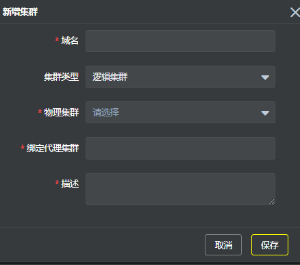

## 概述

为了更好的了解Elasticsearch集群的状态、指标等信息，Pallas Console提供可视化界面展示集群信息，状态，索引分布情况，节点监控指标等各种信息，并提供在线重启集群等一系列功能，方便开发，运维等相关人员更好的了解和管理集群。

## 1 集群总览

点击集群管理，可以看到集群的列表信息，并提供了操作集群的快捷入口。

## 2 添加集群

  点击添加集群按钮：

  

  - 域名：集群的域名

  - 集群类型：物理集群；逻辑集群

  - HTTP地址：ES集群地址，如有多个，以逗号分隔，如：10.0.0.1:9200,10.0.0.2:9200,10.0.0.3:9200

  - ES client地址 ：ES client地址，如有多个，以逗号分隔，10.0.0.1:9300,10.0.0.2:9300,10.0.0.3:9300

  - 绑定代理集群：pallas-search地址

  如果是添加逻辑集群，则无须填HTTP地址和ES client地址,如图：

## 3 路由管理

旨在为不同的请求定制不同的路由规则，详细设计见Pallas-search。

- 3.1 默认路由规则: 无
 
- 3.2 创建路由规则:

  同索引中的路由管理
  
- 3.3 节点集

  当前只有普通级别,用户可以编辑指定所要路由到的集群节点

## 4 集群管理

提供一系列集群的指标信息，帮助开发，运维更好的了解集群的状态。

> 为了加强Pallas Console对集群的管理，集成了两个比较重要的ES集群管理工具，`bigdesk`和`cerebro`，并且集成到同一个视图来管理，如下：

### Bigdesk

如图所示，相关人员可以直接操作所有bigdesk的所有操作和查看所有节点的即时状态，更多详细的操作请参考[bigdesk](https://github.com/hlstudio/bigdesk)的官网。

### Cerebro

Pallas Console同时集成了ES集群管理管理工具`Cerebro`供用户操作，用户可以自行进入`索引信息，节点信息，命令行工具`等tab进行操作。更详细的`Cerebro`的操作可以参考[官方文档](https://github.com/lmenezes/elasticsearch-kopf)(Cerebro的前身是kopf)。

## 5 重启

可通过pallas-console重启ES集群

集群总览页，操作栏点击对应集群的重启按钮，进入如下页面：

点击重启按钮，等待完成重启

## 6 编辑

可以修改Cluster Address，Pallas Search Address

## 7 删除

> 注意：当此集群上存在索引时，不能删除 