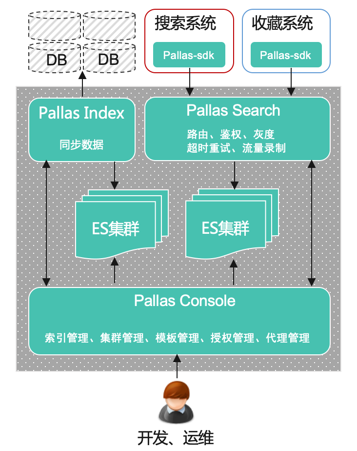
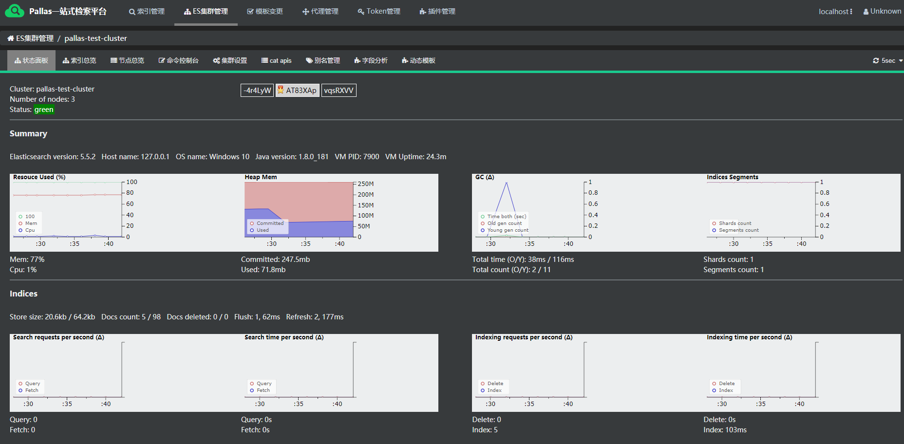

#    Pallas 
<b> Curator is to Zookeeper what Pallas is to Elasticsearch.<p>
&#8195;&#8195;&#8195;&#8195;&#8195;&#8195;&#8195;&#8195;&#8195;&#8195;&#8195;&#8195;&#8195;&#8195;&#8195;&#8195;&#8195;&#8195;--Dylan.Xue</b>

Pallas, the VIP.com's uniform search platform, built on top of the [elasticsearch](https://github.com/elastic/elasticsearch), aiming to solve all kinds of search-problem, such as full-text search with scoring, database sharding search, big-data search, complex aggregation search along with performance, scalability and high avaliability required, which are hard to sovled by the tradition SQL or NoSQL database. Shinning features include:
* ES visualization management & monitoring tools based on [Cerebro](https://github.com/lmenezes/cerebro), [bigdesk](http://bigdesk.org/), [sense](https://github.com/StephaneBour/sense-chrome). You can get them all by visiting http://localhost:8081.
* ES search template management based on index level.
    * CURD, render and debug the templates.
    * Import and export.
    * Include syntax, highlighting, json fromat.
    * Review process required before taking effect.
    * Version comparing.
    * Template canary.
* Deep integration between MySQL and ES.
    * Field Mapping auto generated based on MySQL schema.
    * Generate DSL via [elasticsearch-sql](https://github.com/NLPchina/elasticsearch-sql).
    * Data-sync from DB to ES, including full-import/checking/binlog-based incremental update.(base on [saturn](https://github.com/vipshop/Saturn) and [rdp](https://github.com/vipshop/rdp), to be open) 
* ES http-protocol proxy.
    * Netty-based application with filter-chain pattern.
    * Service governance: index routing/timeout/retry/flow-record/slow log/index and template canary/toke-based authorization.
    * Together with Client-SDK provides you with load balance/failover abilities.
* Pallas ES-plugin updated without a restarat.
    * Extends from AbstractSearchScript.
    * Each plugin has its own classloader.
    * Thorough class loading & unloading.
* Pallas Console
    * ES clusters management.
    * Index management.
    * Tempalate review process.
    * ES-proxy management(metrisc/offline & online).
    * Token management.
    * Pallas plugin management.

Pallas是唯品会统一的检索平台，基于ElasticSearch深度定制，解决关系数据库和NOSQL均无法有效处理的文本检索打分，模糊查询，数据多关键字组合查询，聚合等问题场景。
功能包括:
* ES可视化管理监控，基于[Cerebro](https://github.com/lmenezes/cerebro)，[bigdesk](http://bigdesk.org/)，[sense](https://github.com/elastic/sense)。通过访问http://localhost:8081 就能全拥有了。
* ES模板管理，基于索引粒度
    * 增删改查、渲染DSL、在线调试
    * 批量导入导出
    * include语法， json 美化，高亮语法
    * 模板审核机制，灰度上线
    * 新旧版本对比
* 深度整合MySQL和ES
    * 基于db schema自动生成Field mapping
    * 通过[elasticsearch-sql](https://github.com/NLPchina/elasticsearch-sql)自动转化SQL到ES DSL。
    * 数据同步（全量、对账、增量），基于[saturn](https://github.com/vipshop/Saturn) 和 [rdp](https://github.com/vipshop/rdp)，这块很快会开源。
* ES http协议代理
    * 基于netty和filter链模式代理http请求
    * 完善的服务治理：路由、超时重试、流量录制、索引和模板灰度、基于token的鉴权
    * 配合使用client-sdk，能做到负载均衡、自动容错
* Pallas的ES插件，线上热插拔
    * Extends from AbstractSearchScript
    * 独立的classloader设计
    * 完善的class加载和卸载
* Pallas Console管理控制台
    * ES集群管理
    * 代理管理(监控指标、上线下线）
    * token管理
    * 模板审核流程
    * 插件管理

## Main modules 主要模块
Modules|Functionalities
-|-
pallas-es|基于ES 5.5.2<br >增加在线升级、在线重启插件<br >提供rpm包，一键安装
pallas-index<br ><font color=red>尚未开源</font>|同步数据模块，包括全量、增量、对账<br >同步状态检测
pallas-search|ES http代理层<br >服务治理：鉴权、路由、超时重试、流量复制、模板灰度、别名灰度等
pallas-console|索引管理：管理索引、管理模板、管理版本、流量录制、路由管理、服务治理、索引操作记录等等<br >集群管理：管理ES集群，集成cerebro可视化管理系统，集成bigdesk可视化监控<br >权限管理：基于token的授权方式<br >代理管理：上线/下线代理，实时查看qps/流量记录/连接数
pallas-client|基于ES rest client<br >自动负载均衡<br >超时重试<br >可配置直连ES还是经过proxy


## Pallas architecture


## How it looks 
<p>
<p>
<p>
<p>

## Quick Start
Visit http://localhost:8081 after running the following command, make sure you have >=jdk8 installed.
```bash
cd quickstart
java -Dfile.encoding=UTF-8 -jar pallas-demo.jar
(或者运行：sh quickstart.sh)
```
Click here for more details: [Quick Start](https://vipshop.github.io/pallas/#/zh-cn/1.x/tutorial)

## Documents
[Get Started](https://vipshop.github.io/pallas/#/zh-cn/1.x/tutorial)

## Team members
* Architect & Dev Leader: Dylan Xue (dylan_xueke@hotmail.com)  
* Developer: Chembo Huang (chemboking@qq.com)
* Developer: Jamin Li (jaminlai@163.com)
* Developer: Owen Li (owen.li.zhihao@gmail.com)
* Developer: Tanner Cai (tannercai@hotmail.com)
* Developer: Haiming Wang (haiming.wang@outlook.com)
* Tester: yy.xu (yongyong68@qq.com)
* Front end: Gier Cai (782830164@qq.com)