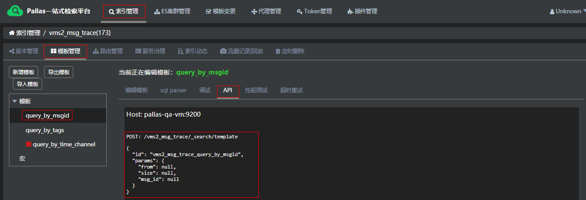

## 概述

Pallas rest客户端对Elasticsearch-rest进行了封装了，并且做了如下工作：

- 优化http连接属性默认值：最大连接数、maxPerRoute、timeout时间等

- 增加一些header：Content-type/token/es/host(without 80 port)/lz4/templateId

- 集成监控埋点

- 自动路由发现并连接至具体的Pallas search，具体调用链为client -> pallas search -> es


## 一 设计


上图简要描述了Pallas客户端的实现原理：

1. 开发人员使用客户端时，需传入Token。Token控制开发人员的访问权限，详见Pallas Console中的Token设计。

2. 客户端`定时`从Pallas Console获取Pallas Search或者ES Cluster的地址。如果Token是启用中的状态，获取的是Pallas Search（详见Pallas Search设计）的地址；如果Token处于禁用中，获取的是ES cluster地址。

3. 当Token授权的集群发生变化时，客户端内部会重新构建PallasRestClient，同时后台线程会将之前创建的PallasRestClient销毁，此过程对开发人员透明。

## 二 准备工作 

### 2.1 环境要求
   
  - Java版本 >= 1.8
  
### 2.2 设置 Pallas-Rest-Client 访问不同环境的Console

客户端默认会起线程访问 localhost:8080（Pallas Console的地址），根据token拿到Pallas search地址进行连接。所以不同环境要配置不同host，

```java
通过增加env -DVIP_PALLAS_CONSOLE_QUERY_URL=http://my-pallas-console.com/pallas/ss/query_pslist_and_domain.json
或者本地代码在是用PallasRestClient前面增加静态代码片段
{
    System.setProperty("VIP_PALLAS_CONSOLE_QUERY_URL",
    			"http://my-pallas-console.com/pallas/ss/query_pslist_and_domain.json");
}

```  

## 三 Maven Dependence

````
<dependency>
  <groupId>com.vip.pallas</groupId>
  <artifactId>pallas-rest-client</artifactId>
   <!-- 修改成指定版本 -->
  <version>master-SNAPSHOT</version>
</dependency>

````

## 四 客户端用法

### 4.1 申请Token  

  由于使用了token鉴权授权，业务开发需要告诉Pallas对接人要用到哪些索引，Pallas对接人会针对这些索引开同对应的权限。

  > 当前,不同的环境配置不同的token,业务开发切记配置正确token
   
### 4.2 初始化PallasRestClient

  - 方式一(推荐)
  
    >使用默认HttpClient
  
    ```java
    PallasRestClient restClient = PallasRestClientBuilder.buildClient(token, maxTimeoutMils);
      
    ```
    参数解释:
  
     - token: 鉴权token,不同环境设置不同的token
     - maxTimeoutMils : ES原生RestCient中的参数，最大重试超时时间
  
  - 方式二
  
    >   使用自定义的HttpClient
    
    ````java
     RequestConfig.Builder requestConfigBuilder = RequestConfig.custom()
             .setConnectTimeout(int connectTimeout).setSocketTimeout(int socketTimeout)
             .setConnectionRequestTimeout(int connectionRequestTimeout);
             
     CloseableHttpAsyncClient httpClientBuilder = HttpAsyncClientBuilder
             .create().setDefaultRequestConfig(requestConfigBuilder.build())
             .setMaxConnPerRoute(int maxConnPerRoute).setMaxConnTotal(int maxConnTotal).build();
     
     PallasRestClient customConfigRestClient = PallasRestClientBuilder.buildClient(token, httpClientBuilder, maxTimeoutMils);
    ````
     
     参数解释:
     
       - connectTimeout: 链接建立的超时时间
       
       - socketTimeout: 套接字超时
       
       - connectionRequestTimeout: http clilent中从connetcion pool中获得一个connection连接的超时时间
       
       - maxConnPerRoute: 同一个route最大的并发连接数
       
       - maxConnTotal: 最大并发连接数
       
       - maxTimeoutMils : ES原生RestCient中的参数，最大重试超时时间
         
         > 这几个超时参数的区别: maxTimeoutMils为总超时，即是只要这个时间到了，就一定超时了。因此业务只需要关心maxTimeoutMills即可。
    
    > 使用推荐: 请把该代码放在jvm容器启动后执行的地方并缓存起来。（初始化一次，持续用）
    
### 4.3 调用template
  
  - Pallas console查询API
  
    
  
  - 执行请求
    
    ````java
      HttpEntity entity = new NStringEntity("{\"id\":\"vms2_msg_trace_query_by_msgid\"}", ContentType.APPLICATION_JSON);
      
      String method = "POST";
            
      String endPoint = "/vms2_msg_trace/_search/template";
      
      String templateId = "vms2_msg_trace_query_by_msgid";
     
      Response response = restClient.performRequestWithEmptyParamsAndNoHeaders(method, endPoint, templateId, entity);
      
      //或者
      Response response = restClient.performRequest(method, endPoint ,Collections.<String, String>emptyMap(), templateId, entity, new Header[0]);
    ````

### 4.4 解析返回值
  
  以Json格式返回结果
 
   ````java
   HttpEntity httpEntity = response.getEntity();
  
   String jsonString = EntityUtils.toString(httpEntity);
  
   //将json字符串转为所需Object
   JSON.parseXXX(jsonString, XXX);
     
   ````    


