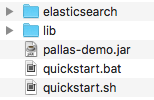
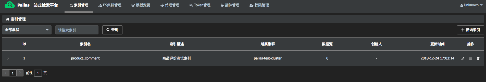
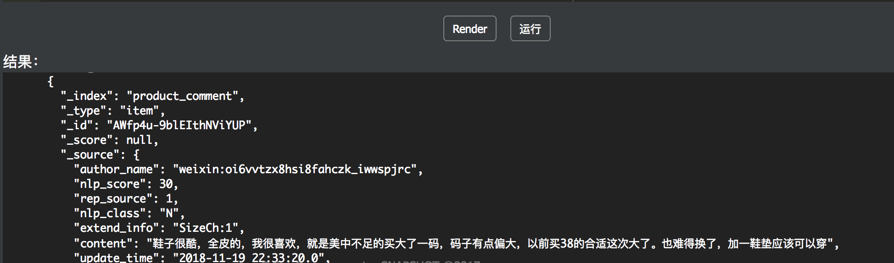
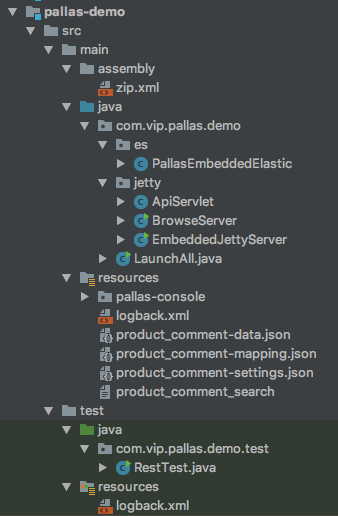
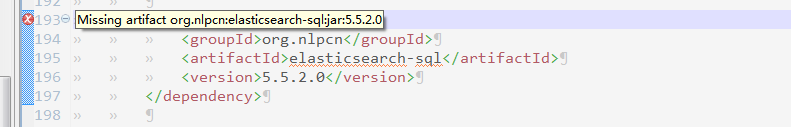
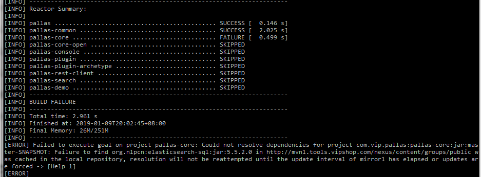

## 一键启动

### 1.1 下载

直接访问[https://github.com/vipshop/pallas](https://github.com/vipshop/pallas) ，下载quickstart目录内容到本地。

### 1.2 解压及运行

把下载下来的包直接解压，如下图：



进入quickstart目录

运行命令：`java -Dfile.encoding=UTF-8 -jar pallas-demo.jar`

`也可以直接运行：sh quickstart.sh，或者在pallas-demo中直接运行com.vip.pallas.demo.LaunchAll，也可以一键quickstart~~（代码导入见后面章节）`


即可启动pallas各主要组件，包括

  - 嵌入式ES及测试数据
  - pallas-console，包括api和ui
  - pallas-search
  - db（h2）及测试数据
  
PS，运行资源要求：
  - 1G左右内存空间，包含3个ES实例，1个SpringBoot、JettyServer和NettyServer等
  - 1G左右磁盘空间，包含demo代码包、解压及ES安装包，索引数据等
  - 若干CPU
  - 可以脱机运行，不需要依赖外部网络  
  
启动完成后，会自动打开默认浏览器并进入pallas-console主页，在主页上，可以看到初始化好的测试数据



同时，可以关注控制台日志，跟踪系统状态
  
  

`pallas-console已经启动了，且独立不依赖任何外部数据，可以随便玩~~`

## 搜索及调用

### 2.1 在线调试

点开索引`product_comment`，进入索引管理页面，然后点击`模板管理`，选择`product_comment_search`，点击`编辑模板`，可以看到当前的查询模板内容：

  


进入`调试`tag页面，点击`运行`按钮（已经默认好调试参数，其他模板或者场景可以按需修改）

  

结果区域可以看到运行的结果：

  

在线调试的结果表明，查询模板已经发送到ES，并且返回到相应的结果，下面我们用restclient通过代码来进行搜索查询。


### 2.1 代码导入（idea）

pallas-demo作为pallas的其中一个module，也是一个普通的maven project，如果你已经导入了pallas，那IDE会自动识别出子module。或者可以像一般的maven工程直接import就可以了。



### 2.2 搜索调用例子

```java
package com.vip.pallas.demo.test;

import com.vip.pallas.client.PallasRestClient;
import com.vip.pallas.client.PallasRestClientBuilder;
import com.vip.pallas.search.launch.Startup;
import org.apache.http.HttpEntity;
import org.apache.http.entity.ContentType;
import org.apache.http.nio.entity.NStringEntity;
import org.apache.http.util.EntityUtils;
import org.elasticsearch.client.Response;
import org.slf4j.Logger;
import org.slf4j.LoggerFactory;

import java.lang.reflect.InvocationTargetException;
import java.lang.reflect.Method;
import java.util.Collections;

import static java.nio.charset.StandardCharsets.UTF_8;

public class RestTest {

    public static void main(String[] args) throws IllegalAccessException,
            IllegalArgumentException, InvocationTargetException, NoSuchMethodException, ClassNotFoundException {
        System.setProperty("VIP_PALLAS_CONSOLE_QUERY_URL",
                "http://localhost:8080/pallas/ss/query_pslist_and_domain.json");

        System.setProperty("pallas.stdout", "true");

        ClassLoader classLoader = Startup.class.getClassLoader();
        Class<?> loadClass = classLoader.loadClass("com.vip.pallas.demo.test.ProductCommentTest");
        Method method = loadClass.getMethod("search");
        method.invoke(null);
    }
}


class ProductCommentTest {

    private static final Logger LOGGER = LoggerFactory.getLogger(ProductCommentTest.class);

    public static void search() throws Exception {
        final PallasRestClient buildClient = PallasRestClientBuilder.buildClient("aaaaaaabbbbbbbccccccc==", 2000);
        final HttpEntity entity = new NStringEntity("{\n" +
                "    \"id\" : \"product_comment_product_comment_search\",\n" +
                "    \"params\" : {\n" +
                "        \"vendor_id\": 601000,\n" +
                "        \"contenet\": \"鞋\"\n" +
                "    }\n" +
                "}", ContentType.APPLICATION_JSON);

        Response response = buildClient.performRequest("POST",
                "/product_comment/_search/template", Collections.EMPTY_MAP, "product_comment_search",
                entity);

        LOGGER.info("search result: {}", EntityUtils.toString(response.getEntity(), UTF_8));
    }
}

```

直接在本机运行com.vip.pallas.demo.test.RestTest（因为前面已经一键启动相关服务），观察返回结果，控制台输出如下：
```java

[2018-12-24 17:52:44.750] [INFO] [main] [com.vip.pallas.client.PallasRestClientBuilder] >>> old-restClient-cleaner started.
[2018-12-24 17:52:45.724] [INFO] [main] [com.vip.pallas.utils.IPUtils] >>> we got ip :Jamins-MacBook-Pro.local/127.0.0.1 from  within networkinterfaces :bond0,eth0,em0,br0,enp2s0f0
[2018-12-24 17:52:45.728] [INFO] [main] [com.vip.pallas.client.PallasRestClient] >>> pallas console visitor started.
[2018-12-24 17:52:46.062] [WARN] [main] [com.vip.pallas.client.thread.QueryConsoleTask] >>> esDomain changed from null to pallas-test-cluster
[2018-12-24 17:52:46.065] [WARN] [main] [com.vip.pallas.client.thread.QueryConsoleTask] >>> psList changed from null to [127.0.0.1:9201]
[2018-12-24 17:52:46.065] [INFO] [main] [com.vip.pallas.client.PallasRestClientBuilder] >>> start to construct a rest client for aaaaaaabbbbbbbccccccc==, hosts:[http://127.0.0.1:9201]
[2018-12-24 17:52:46.085] [INFO] [main] [com.vip.pallas.client.PallasRestClientBuilder] >>> rest client started, hosts: [http://127.0.0.1:9201], token: aaaaaaabbbbbbbccccccc==, maxTimeoutMils: 2000
[2018-12-24 17:52:46.682] [INFO] [main] [com.vip.pallas.demo.test.ProductCommentTest] >>> search result: {"took":117,"timed_out":false,"_shards":{"total":1,"successful":1,"failed":0},"hits":{"total":1,"max_score":null,"hits":[{"_index":"product_comment","_type":"item","_id":"AWffd5Bw1Mg8grAIu9qz","_score":null,"_source":{"author_name":"weixin:oi6vvtzx8hsi8fahczk_iwwspjrc","nlp_score":30,"rep_source":1,"nlp_class":"N","extend_info":"SizeCh:1","content":"鞋子很酷，全皮的，我很喜欢，就是美中不足的买大了一码，码子有点偏大，以前买38的合适这次大了。也难得换了，加一鞋垫应该可以穿","update_time":"2018-11-19 22:33:20.0","third_rep_source":0,"video_url":"","author_uid":83946464,"approval_user":"nlp_audit","vip_bill_count":0,"image_count":0,"approval_time":"2018-11-19 22:33:20.0","id":37258501,"spu_id":105911271458660350,"index_desc":0,"store_id":"","goods_name":"吐火罗2018新品加绒加厚纯色百搭马丁靴","nlp_keyword_show":"其它","create_time":"2018-11-19 22:22:17.0","goods_id":699983297,"is_nlpmark":1,"sku_id":105911271458660430,"brand_name":"狂欢再继续-吐火罗TOKHAROI手工鞋包专场","video_length":0,"avatar":"","reply_count":0,"is_top":0,"post_time":"2018-11-19 22:22:17.0","brand_sn":10022928,"video_thumbnail":"","is_satisfied":1,"impresses":"690:时尚^690:休闲^690:耐磨^690:防滑","is_anonymous":0,"cat3_id":281,"vendor_id":601000,"is_essence":0,"schedule_id":3595310,"useful":0,"order_sn":"18111151058803","status":4},"sort":[1542666137000]}]}}

```

pallas-rest-client已经通过pallas-search访问到es，并取到正确结果返回，下一步，可以根据需要，提取`response.getEntity()`的内容并处理。

## 可能出现的问题

### 3.1 elasticsearch-sql相关

  现象：IDEA、Eclipse等集成开发环境导入代码，或者maven构建时出现如下情况：The POM for org.nlpcn:elasticsearch-sql:jar:5.5.2.0 is missing, no dependency information available.
  
  
  
  
  
  两种解决方式，选其一：
  
  - 修改Maven Setting
  
    - 检查Maven Setting：${maven.home}/conf/settings.xml; ${user.home}/.m2/settings.xml，如果&lt;mirror&gt;标签中使用了&lt;mirrorOf&gt;*&lt;/mirrorOf&gt;，建议使用profile的方式配置repository
  
  - Maven Install file
  
    -  ```mvn initialize -Pinitialize```
  
  
  
  