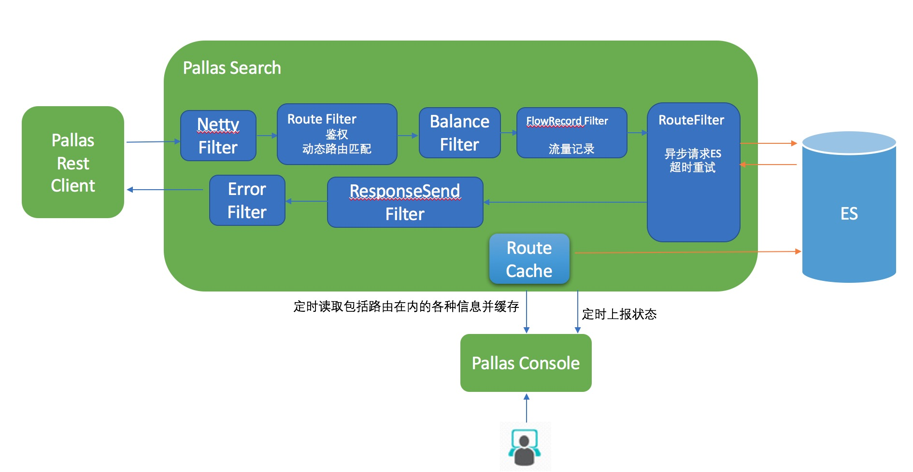
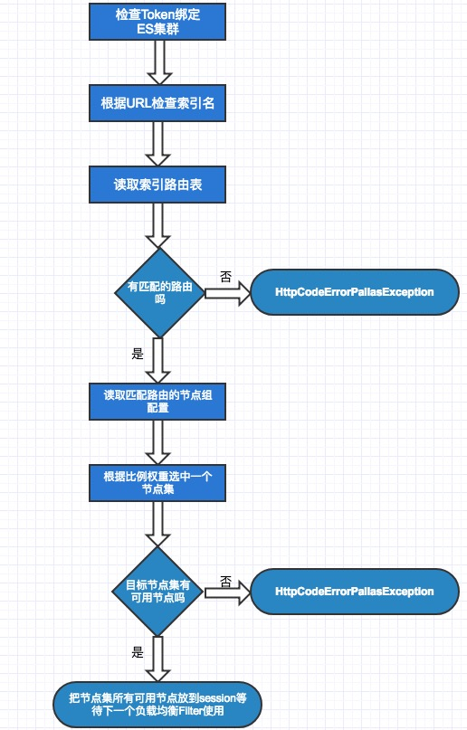
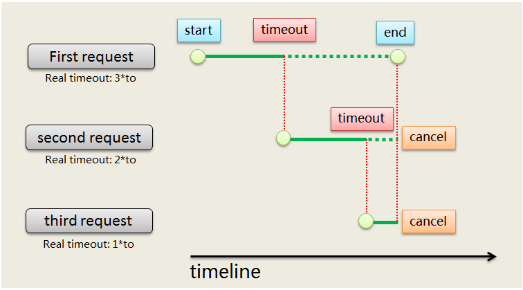
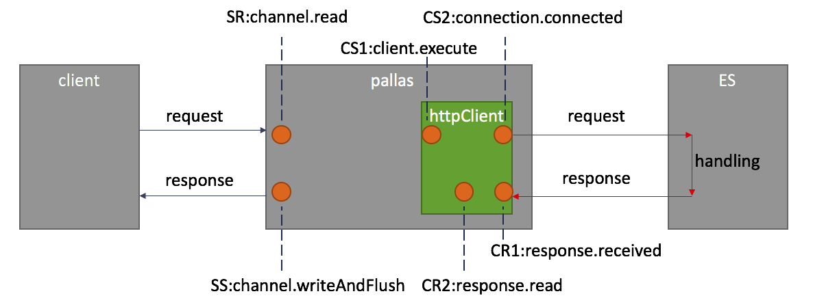

## 概述

- `Pallas Search` 是运行在`Pallas Rest Client` 和 `Elasticsearch集群`之间的查询代理节点，以弥补把ES集群直接曝露给业务调用侧的一些缺陷

- `Client`侧带上Token，请求`Pallas Search`，即可达到访问ES集群的目的，无需关心自己调用的是哪个ES集群，请求被负载均衡到了哪个节点

- 除此之外，`Pallas Search` 具有诸如鉴权、超时重试、动态路由管理等功能

## 1 设计

`Pallas Search` 是基于`Netty` 框架的Nio应用。因此request 和Response 都是异步来完成的。总体流程如下图所示：

## 2 鉴权逻辑

`Pallas Rest Client`发送请求到`Pallas Search`，会带上预分配的一个Token。`Pallas Search`会根据请求头的Token 和`Pallas Console`对该Token 的授权信息进行校验，来判断这个Token 是否具有当前请求的操作权限。
如果业务方希望执行相应的操作，则必须具备有相应的权限，Pallas Search对Client端的操作类型的判断规则如下:

* URL包含 "/_search/template"、"/_search"、"/_render"、以/{id}结尾、"/_settings"和"/_mapping"结尾和直接"/{indexName}/"结尾的GET请求，认为是索引读操作

* 上面请求的POST操作以及“/_bulk”、“/_update”、“/_update_by_query”、“/_delete_by_query”、以及“PUT”和“DELETE” 请求，认为是索引的修改操作

* URL中识别不出有 index pattern的的“GET”请求，认为是集群的读操作

* URL中识别不出有 index pattern的的“POST”请求，认为是集群的修改操作

`Pallas Search` 的判断顺序是：

* 目标集群的修改权限

* 目标集群的读权限

* 目标集群下目标索引的修改权限

* 目标集群下目标索引的度权限

* 返回403 Forbidden

值得注意的是，目前的`Pallas Search` 还有一个默认配置 `pallas.search.authorication.default=ReadOnly` 。当`Client`端并没有带上Token的时候，`Pallas Search` 默认的授权是`ReadOnly` 意思是对下游的所有ES集群的请求授`只读`权限，可以通过启动参数来修改这个值为`Write`可以授予默认有`写`权限。

当客户端执行一个没有授权的操作时，将会收到一个 `403` 错误。
>2018-12-10 15：35：14.740] [ERROR] [http-nio-8080-exec-309] [com.vip.pallas.console.exception.ExceptionHandler] >>> no domain matched by this token aaaaaaabbbbbbbccccccc==
>java.lang.IllegalArgumentException: no domain matched by this token aaaaaaabbbbbbbccccccc==
>at com.vip.pallas.console.controller.server.ServerController.queryPsListAndDomain(ServerController.java:217)
	at com.vip.pallas.console.controller.server.ServerController$$FastClassBySpringCGLIB$$88d011bc.invoke(<generated>)
	at org.springframework.cglib.proxy.MethodProxy.invoke(MethodProxy.java:204)

## 3 Route Cache 机制

`Pallas Search`后台会有一个Route Cache的机制，基于Google Guava 缓存框架，定时访问（默认30s）`Pallas Console` 抓取最新的配置数据并缓存。

`Pallas Search`在处理`Client`的请求的时候，访问的是Guava 的Cache，而不会实时访问`Pallas Console`配置的信息，因此一个配置的生效时间，最长会有30s的延迟。

如果发现在`Console`的配置没有生效，可以留意`Pallas Search` 的相关日志的输出是否有错误信息，或者留意`Pallas Search`的状态上报是否已经中断。

更详细的关于缓存的逻辑可以访问源码Java 类`com.vip.pallas.search.cache.RoutingCache`查看相关逻辑。

## 4 路由选择逻辑

路由选择逻辑可以参考下面的流程图，关于路由的配置可以参考`索引管理`下的`路由管理`一节。

这里有几点需要注意：

* `Pallas Console` 创建一个索引的时候会同时为这个索引创建了一个默认路由，确保在完全没有配置路由信息的情况下依然可以把请求发送到正确的ES集群

* 路由表的匹配是按所有`启用`列表从上到下找到第一个匹配的

* 如果一个路由配置中配了多个的`节点集`，那么节点集之间的比例关系是采用了`java random()` 机制来选取一个节点集

* 选中了节点集之后，`Pallas Search` 还会根据 `Route Cache`中筛选出该索引所绑定的所有`存活`的ES节点（排除下线的data node，还有exclude node），最后和节点集配置的节点列表取交集拿到最后的可用的节点列表

如想了解更详细的细节可以参考源码实现。

## 5 ES请求负载均衡

目前只采用了一个默认的随机算法，在可用的节点中随机选一个ES节点来转发请求。

如需实现特定的负载均衡算法，可以重写类`com.vip.pallas.search.filter.route.BalanceFilter`

## 6 超时重试逻辑

超时重试配置目前是索引级别

通过`Route Cache`模块访问`Pallas Console`进行定期更新，其中key为`{indexName-templateName}`，value为超时重试对象。

主要逻辑体现在如下红色的`RestInvokerFilter`类，这里就是构造具体的httpRequest并通过httpClient进行异步调用，最后将请求结果送到下一个filter。

我们的超时重试就是控制请求发送--请求返回这一过程。需要注意的是，因为这里已经过了balanceFilter得到某一具体的机器，多次重试都只会去到同一台机器。

主要设计思路为不cancel前面的请求同时开始新的请求，最终以先返回者为准并canel其它请求。如下图：

关于超时重试的配置可以参考`索引管理`的`超时重试`一节。

## 7 调用链跟踪

### 7.1 时间埋点

请求调用链时间点埋点是`Pallas Search` 增值服务中的一大特色，在`Pallas Search`中，我们已经为请求的生命周期一些关键点都埋了时间点。如下图所示：

*   sr: netty收到客户端请求
*   ss: netty发送响应给客户端
*   cs1: httpclient调用execute方法
*   cs2: 获取到连接并成功建立连接(有可能发送了请求)
*   c_duration: cs2-cs1，httpclient从开始执行到建立连接时间
*   cr1: IO线程获取到请求响应
*   cr2: IO线程处理完响应，下一步调用sendResponse
*   fly: cr1-cs2, 网络无延时时，约等于es处理的时间，如上图红线所示
*   ps_side: ps端执行的总时间，(sr-cs2) + (ss-cr1)
*   s_duration: ss-sr，基本就是fly + ps_side时间，即ps收到请求到发回响应总时间

在`Pallas Search`自身的Slow Log日志里，打印慢查询的时候，会把这些埋点信息打印出来，方便跟踪，以下是一个日志片段
>10.0.0.1    -               GET /getPsListAndEsDomain?random=34x HTTP/1.1   status=200      s_duration=562  c_duration=561  fly=552 ps_side=10      cs2-cs1=8       cr2-cr1=1       cs1=1537854921696       cs2=1537854921704       cr1=1537854922256       cr2=1537854922257       sr=1537854921695        ss=1537854922257        content-length=55(bytes)        -       Apache-HttpAsyncClient/4.1.2 (Java/1.8.0_151)   10.0.0.1   10.0.0.1:9225      xueshutingdeMacBook-Pro.local   10.0.0.1:5194      -       200     -       -4502407469547719273

### 7.2 调用链上报

 `Pallas Search` 提供一套接口来帮助使用者可以方便的把以上数据加工提炼并生成日志发送到指定的日志监控系统或者调用链跟踪系统。如果需要的话可以复写`Pallas Search`的默认实现`com.vip.pallas.search.trace.DefaultTraceAop` 来完成。

### 7.3 定时状态上报

`Pallas Search` 节点启动后，除了会把自己的启动参数上报到`Pallas Console`，附带的还会上报自身的一些统计信息，如`QPS，HTTP 连接数，网卡吞吐量`等等。这些数据默认是每10s会上报一次，上报后的信息会展示在`Console`面板，具体可以参考 `代理管理`章节。

### 7.4 流量记录

详细设计请参考`流量记录`章节。

## 8 性能测试报告

### 8.1测试环境

为了更准确地测试各种数据包大小，采用nginX转发静态资源的形式来模拟ES集群，另外，为了实现Pallas-Search对ES集群节点的健康检测，同时通过nginX模拟ES集群的endpoint，包括_cat/nodes等。各组件部署情况如下：

|ip| 组件 | 操作系统 | CPU | 内存 | 网卡 | 硬盘 |
|---|---|--------|----|----|----|----|
|10.0.0.1|pallas-search.api.vip.com|CentOS release 6.6 (Final)|2600MHz*24|126G|20000Mb/s|1706G|
|10.0.0.1|mock-es-cluster|CentOS release 6.6 (Final)|2500MHz*24|189G|20000Mb/s| 529G|
|10.0.0.1|mock-es-cluster|CentOS release 6.6 (Final)|2500MHz*24|189G|20000Mb/s| 24582G|

### 8.2 测试场景

主要覆盖在不同并发，不同payload大小，已经不同路由规则情况下Pallas-Search的性能表现，并与不通过Pallas-Search直接连接后端接口的性能对比。

1.  100并发，集群级别路由，不限TPS，1Kpayload
2.  100并发，集群级别路由，不限TPS，10Kpayload
3.  100并发，集群级别路由，不限TPS，100Kpayload
4.  500并发，集群级别路由，不限TPS，1Kpayload
5.  500并发，集群级别路由，不限TPS，10Kpayload
6.  500并发，集群级别路由，不限TPS，100Kpayload
7.  100并发，集群级别路由，限2W5TPS，1Kpayload
8.  100并发，集群级别路由，限2W5TPS，10Kpayload
9.  100并发，集群级别路由，限5000TPS，100Kpayload
10.  500并发，集群级别路由，限2W5TPS，1Kpayload
11.  500并发，集群级别路由，限2WTPS，10Kpayload
12.  500并发，集群级别路由，限5000TPS，100Kpayload

### 8.3测试结果

|不限TPS-100并发|平均响应时间|80%响应时间|95%响应时间|99%响应时间|最大响应时间|TPS|192.168.1.1 CPU user|192.168.1.2 CPU|user	192.168.1.3 CPU user|
|---------------|------------|-----------|-----------|-----------|------------|---|-----------------------|-------------------|----------------------------|
|【Search】1Kpayload,100并发|1|2|3|14|126|55589|7%|51%|4%|
|【Search】10Kpayload,100并发|2|3|5|16|381|42518|6%|48%|5%|
|【Search】100Kpayload,100并发|8|13|21|224|1044|10760|3%|32%|1%|		
|【伪ES】1Kpayload, 100并发|0|0|1|1|20|66535|5%|/|6%|

|不限TPS-500并发|平均响应时间|80%响应时间|95%响应时间|99%响应时间|最大响应时间|TPS|192.168.1.1 CPU user|192.168.1.2 CPU user|192.168.1.3 CPU user|
|---------------|------------|-----------|-----------|-----------|------------|---|-----------------------|-------------------|----------------------------|
|【Search】1Kpayload,500并发|8|11|15|34|826|59082|7%|48%|4%|
|【Search】10Kpayload,500并发|10|14|19|42|263|47492|7%|49%|4%|
|【Search】100Kpayload,500并发|43|61|102|437|4073|10950|4%|35%|2%|
|【伪ES】1Kpayload,500并发|0|1|1|2|183|73253|6%|/|6%|	

|限TPS-100并发|平均响应时间|80%响应时间|95%响应时间|99%响应时间|最大响应时间|TPS|192.168.1.1 CPU user|192.168.1.2 CPU user|192.168.1.3 CPU user|
|-------------|------------|-----------|-----------|-----------|------------|---|-----------------------|------------------------|-----------------------|
|search_target2node_mockes_1kpl_100_2w5TPS|0|1|1|13|58|24163|4%|22%|2%|
|search_target2node_mockes_10kpl_100_2wTPS|0|1|1|14|78|19327|4%|22%|2%|
|search_target2node_mockes_100kpl_100_5kTPS|4|5|11|207|665|5040|3%|14%|1%|

|限TPS-500并发|平均响应时间|80%响应时间|95%响应时间|99%响应时间|最大响应时间|TPS|192.168.1.1 CPU user|192.168.1.2 CPU user|192.168.1.3 CPU user|
|-------------|------------|-----------|-----------|-----------|------------|---|-----------------------|------------------------|-----------------------|
|search_target2node_mockes_1kpl_500_2w5TPS|0|1|1|18|81|25552|4%|23%|2%|
|search_target2node_mockes_10kpl_500_2wTPS|0|1|1|20|93|20231|4%|23%|2%|
|search_target2node_mockes_100kpl_500_5kTPS|3|4|8|38|1004|5162|2%|14%|1%|	

